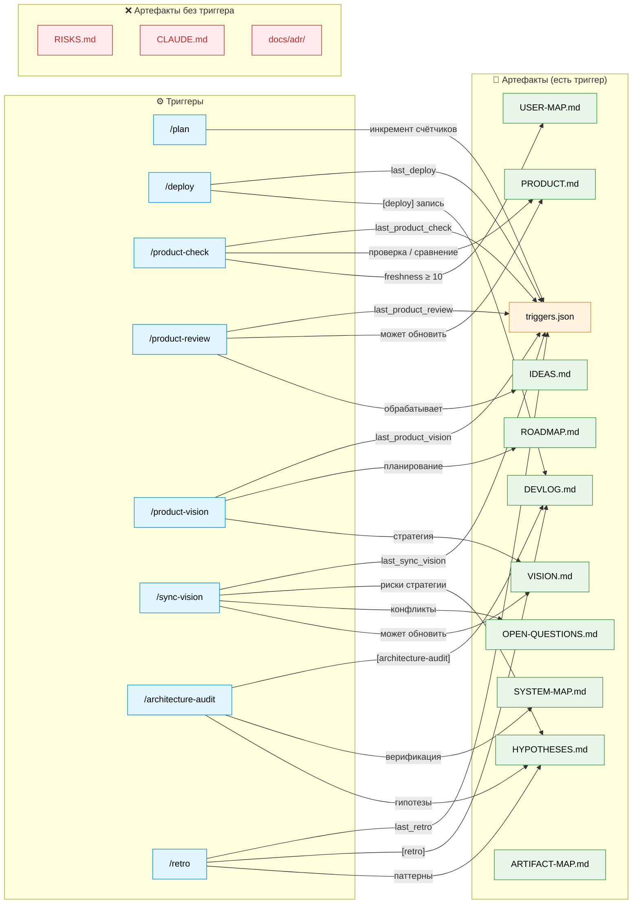

# ARTIFACT-MAP — methodology-platform

Карта **жизненного цикла артефактов**: какая команда обновляет какой файл, как часто, и где gap.
Дополняет [SYSTEM-MAP](SYSTEM-MAP.md) (компоненты и связи) слоем актуальности.

> **Не синхронизируется `sync-methodology.sh`.** Обновлять при: добавлении новой команды / артефакта; изменении частоты триггера.

---

## Диаграмма: команды → артефакты

Синий = команда · Оранжевый = state · Зелёный = артефакт с триггером · Красный = gap (нет триггера)

---

## Lifecycle table

| Артефакт | Команда-триггер | Условие | Частота | Gap |
|---|---|---|---|---|
| `triggers.json` | `/plan`, `/deploy`, все периодические | автоматически | каждый цикл | ✅ |
| `DEVLOG.md` | `/deploy`, `/architecture-audit`, `/retro` | обязательно при деплое | каждый деплой | ✅ |
| `PRODUCT.md` | `/product-check`, `/product-review` | `last_product_check.plans_since ≥ 5` | ~каждые 5 планов | ✅ |
| `docs/product/USER-MAP.md` | `/product-check` (шаг 7) | `last_user_map_sync.plans_since ≥ 10` | ~каждые 10 планов | ✅ |
| `docs/architecture/SYSTEM-MAP.md` | `/architecture-audit` | `plans_since ≥ 5` | ~каждые 5 планов | ✅ |
| `HYPOTHESES.md` | `/architecture-audit`, `/retro`, `/sync-vision` | по событию | при аудите / ретро | ✅ |
| `OPEN-QUESTIONS.md` | `/sync-vision` | при контракт-изменениях | по событию | ✅ |
| `IDEAS.md` | `/product-review` | `plans_since ≥ 10` ИЛИ ≥ 7 unreviewed | ~каждые 10 планов | ✅ |
| `ROADMAP.md` | `/product-vision` | `plans_since ≥ 30` | ~каждые 30 планов | ✅ |
| `VISION.md` | `/product-vision`, `/sync-vision` | `plans_since ≥ 30` | ~каждые 30 планов | ✅ |
| `docs/architecture/ARTIFACT-MAP.md` | ручное | при добавлении команды / артефакта | по событию | ✅ |
| **`RISKS.md`** | — | **нет триггера** | — | ❌ |
| **`CLAUDE.md`** | — | **нет триггера** | — | ❌ |
| **`docs/adr/`** | — | при новом решении | нет ревью старых ADR | ❌ частично |

---

## Known gaps

| Gap | Риск | Возможное решение |
|---|---|---|
| `RISKS.md` без триггера | Риски устаревают незаметно — threat landscape меняется, а файл не обновляется | Добавить в `/retro` или `/product-review` периодический check |
| `CLAUDE.md` без триггера | Правила могут расходиться с реальной практикой проекта | Добавить в `/architecture-audit` или `/retro` check на устаревшие правила |
| `docs/adr/` без ревью устаревших | ADR от ранних фаз могут противоречить текущей архитектуре — никто не замечает | Добавить в `/architecture-audit` проверку статусов ADR |

---

## Refresh Policy

Обновлять этот файл когда:
- Добавлена новая команда (`/X`) → добавить строку в таблицу + node в диаграмму
- Добавлен новый тип артефакта → добавить строку в таблицу
- Изменился порог триггера (например `plans_since ≥ 7` → `≥ 10`) → обновить колонку "Частота"
- Gap закрыт → переместить из Gaps в Live subgraph, обновить до ✅

`/review` проверяет: новая команда или артефакт → ARTIFACT-MAP обновлён?
