# SYSTEM-MAP — methodology-platform

**Версия:** v1.3
**Обновлён:** 2026-05-18
**Граф проверен против кода:** 2026-05-18 (architecture-audit: 2 phantom dirs resolved)

> Обновлять этот файл в том же PR что и изменения в `scripts/`, `commands/`, `templates/`, или добавления компонентов.
>
> В отличие от обычных проектов, "компоненты" здесь — это **слои репозитория**, а "коммуникации" — это **отношения копирования** между методологией и консьюмерами.

---

## Agent TL;DR

- **Основные подсистемы:** Methodology Platform (canon — commands/templates/scripts) → Self-application (.claude/ в этом репо) → Consumers (проекты с произвольной архитектурой).
- **Источники правды:** `commands/`, `templates/` (включая `templates/.claude/hooks/` и `templates/.claude/agents/`), `VERSION` — единственный canon. `.claude/` в любом проекте — производное.
- **Критичные edges:** scripts (`new-project-init.sh`, `sync-methodology.sh`) → консьюмеры (copy + banner). Нарушение banner-механизма ломает версионную трассируемость.
- **Известные gap-ы:** branch protection не настроен (R-01); CI для idempotent тестирования скриптов отсутствует; нет auto version-drift check у консьюмеров; sync затирает per-project fills в `docs_reminder.py` LIBS.
- **На что обратить внимание при `/plan [data]` или `[contract]`:** изменение схемы `triggers.json.template` = **breaking** (мажор bump + migration). Изменение banner-формата в скриптах = breaking для версионной трассировки.

---

## Граф системы

> 🔗 [Открыть в Mermaid Live](https://mermaid.live/edit#pako:lVZbbttGFN3KhYAATk2RzaMPBI0BRWIcobJlSLJ_aMMYkWNpUpIjkMMkRpTCsps-0KIBiv51E3ISIYZdOVu4s4WspJghZdGWLKf6ECTOmTP3ce4Zviy43KOFB4VORHpdaD3aDgEA4qSdPtgurFHR5R73eWcfNnwi9ngUwJLoshgi2uO3twvpFvUpr1WajsuDgIRebH3XjqyVO3ch9kncLeIpnuO_OMQxvtcreKr_nON4Z8rQWtuoOYIGPZ8ImlH8eP9LkL_iEI_xTMHxHN8CDuWBPMSR_AmHeCoP1cPFtLtP6vXvmzly0_VJ4lGry_kP2VH3AT_gUP6GJ_IQx_J3-Rrka3mkOG8gL63a66157KRDQ5HR3wM5wFMc4RmO5CEOQQ7kER4XcYjvcITjm9JolhvVjVbTid2I9Sakbc5FLCLSg2WI90MXliFgnYgImhKdyAF-xHM8w7FOS51-kiPdshvOlt1oVuvrekNMg2c0ygEamzW76USJP2kIvsMTfA_Ll7JJV8Y4At3pj3giD-SRWpED-Sajo6G3Hc5IrEn9vSLp9XzmEsF4CEuT4gELYb7Umnbt8a7W2wR7WXcXQbwBOQA81tUc40geKBnuXCFKpTFHEP-PJhPBvNbniPAYR_jhMtnwKlWzVWrZF0yxIIJaImKdDo1i82nMQ83qc5f4oFdnCOxWq7q-Oo0mpkKwsDOz2-XhHussbFCZh3ES0Ag-HfwNpXAfehF_Sl1xafbr683NNbuxW66VNivT0PVJk94YoGtrQFoaIw3dgElsO3P4So1W9XGp3Go6KbMZeAZsNOqVzXJL_96qKu2agWfp-u-m_w19cMXeqtVXDahW7FLTgEa9VFkrbRjgcTe2iBdZBpimqaFyIA-1ZE_loTxSPQF5pGYG36oWyQEO8Uz-gWMcGqC-L6ZqpFEj6NGomFVmYTlXmXiStPPFa9gbdafDRDdpmy4PLJcwUYy5n6hxyBTERNGjz4rB1I8X90yXH8rco7AUJaFgAb1s1mUnjynXqmCpOgF9IWgYs0wk8hftGkM1yTBp6hegLPhM_onHag4AP-qBGGknHi2IC__BUep1-B6H02A8FlFXz36tMX1au-OUdqBYXOm7vLcPy9AmYUijPtTuOo9yWqndc8o7UDSLK_2IEg-IgCzjPtTuO5U89CvH3oGHD1f6zyMmaAxeErGwA1bPJyFQ4fah9rXzOL_jG2dVBcH7vSTuWr3E9_tQ-9Z5MpvmrVuQvy5dEvKQqRn79PNfQF9QNxE8ilNs5uU6OxV03NfX57WL6pZZuJia2GJIalDXYrbsRi6VGVt-xgiE9PlE40UWMmHG3ezeySvTjLuzh1zp4YWDfx7ymuwUNENcl5wKs59z1cWIzDZzdaiwWESsrWcRBFeGqd0whqWAhAnx_X3IrJl6t2_M5opRzo8GSCTYHnGFksWME-aCa6Q6B93B9Gm5PB2FOH37gokBz5R9MXgm1plz50yRAZZ6qTTUNJkXp-RGTpv-bEcug1LntrRxW6Zp3lCHSr5JblfV2s9o1yqqrrzfYQJyI6w8N0Wo0bgZkSrwM3CpDhcDp_2eCyoYhYBGAWFe4cHLgujSQL2je3SPJL4ovHr1Hw)
> _(обновить ссылку: `py scripts/mermaid-link.py docs/architecture/SYSTEM-MAP.md`)_

```mermaid
graph TB
    subgraph "Methodology Platform (this repo)"
        CMDS[commands/<br/>12 slash-команд<br/>канон]
        TMPL[templates/<br/>~40 шаблонов артефактов<br/>канон]
        TMPL_HOOKS[templates/.claude/hooks/<br/>4 защитных хука<br/>канон]
        TMPL_AGENTS[templates/.claude/agents/<br/>3 скелета суб-агентов<br/>канон]
        SCRIPTS[scripts/<br/>bootstrap + sync + migrate<br/>исполнители]
        VER[VERSION<br/>semver]
        RULES[rules/<br/>гид + скелет<br/>не копируется]
    end

    subgraph "Self-application (.claude/ in this repo)"
        SELF_CMDS[.claude/commands/<br/>копия с баннером]
        SELF_HOOKS[.claude/hooks/<br/>копия с баннером]
        SELF_AGENTS[.claude/agents/<br/>копия без баннера]
        SELF_STATE[.claude/state/triggers.json<br/>local state]
        SELF_SETTINGS[.claude/settings.json<br/>local config]
    end

    subgraph "Consumer — Any project"
        CONSUMER_CLAUDE[.claude/<br/>commands, hooks, agents, state, settings]
        CONSUMER_ARTIFACTS[CLAUDE.md, PRODUCT.md, VISION.md/AGENT_VISION,<br/>DEVLOG, IDEAS, ROADMAP, docs/adr/, ...<br/>структура универсальна, наполнение per-project]
    end

    subgraph "GitHub"
        REPO[github.com/cait-solutions/<br/>it-dev-methodology]
    end

    subgraph "Claude Code (runtime)"
        CC[Claude Code CLI / IDE extension<br/>читает .claude/* в любом проекте]
    end

    subgraph Легенда
        direction LR
        L1[A] -->|copy + banner| L2[B]
        L3[C] -.->|read at runtime| L4[D]
        L5[E] ==>|writes during /plan etc| L6[F]
        L7[G] --o|push/pull| L8[H]
    end

    %% Methodology canonical → executors
    SCRIPTS -->|reads| CMDS
    SCRIPTS -->|reads| TMPL
    SCRIPTS -->|reads| TMPL_HOOKS
    SCRIPTS -->|reads| TMPL_AGENTS
    SCRIPTS -->|reads| VER

    %% Self-application via new-project-init.sh + sync-methodology.sh
    SCRIPTS -->|copy + banner| SELF_CMDS
    SCRIPTS -->|copy + banner| SELF_HOOKS
    SCRIPTS -->|copy| SELF_AGENTS
    SCRIPTS -->|init| SELF_STATE
    SCRIPTS -->|init| SELF_SETTINGS

    %% Distribution to consumers (manually triggered)
    SCRIPTS -->|copy + banner| CONSUMER_CLAUDE
    SCRIPTS -->|init artifacts| CONSUMER_ARTIFACTS

    %% Runtime reads
    CC -.->|reads slash commands| SELF_CMDS
    CC -.->|reads slash commands| CONSUMER_CLAUDE

    %% Runtime writes during /plan, /code, etc.
    CC ==>|writes state| SELF_STATE
    CC ==>|writes DEVLOG/IDEAS/...| CONSUMER_ARTIFACTS

    %% Distribution channel
    CMDS --o|git push/pull| REPO
    TMPL --o|git push/pull| REPO
    TMPL_HOOKS --o|git push/pull| REPO
    TMPL_AGENTS --o|git push/pull| REPO
    SCRIPTS --o|git push/pull| REPO
```

**Легенда:**
- `-->` Копирование (с баннером для синхронизируемых артефактов)
- `-.->` Чтение в runtime (Claude Code читает slash-команды и хуки)
- `==>` Запись в runtime (Claude Code обновляет triggers.json, DEVLOG, etc.)
- `--o` Распространение через git (push/pull в GitHub)

---

## Компоненты

### `commands/` — Slash-команды (канон)

- **Назначение:** определения 12 slash-команд (`/plan`, `/code`, `/review`, `/deploy`, `/retro`, `/diagnose`, `/onboard`, `/architecture-audit`, `/sync-vision`, `/product-vision`, `/product-review`, `/product-check`)
- **Владелец:** владелец методологии
- **Стек:** Markdown
- **Точки входа:** каждый файл — отдельная команда
- **Зависимости:** читают `.claude/state/triggers.json` в консьюмере; могут читать другие артефакты (DEVLOG, IDEAS, etc.)
- **Записывает:** через инструкции Claude Code — обновления `triggers.json`, записи в DEVLOG/IDEAS/RISKS/OPEN-QUESTIONS

### `templates/` — Шаблоны артефактов (канон)

- **Назначение:** шаблоны для bootstrap новых проектов и для guided заполнения артефактов (~40 файлов)
- **Владелец:** владелец методологии
- **Стек:** Markdown с `{{Project Name}}` placeholders + JSON (triggers, settings) + YAML (services-registry)
- **Точки входа:** `templates/*.template.md`, `templates/*.template.json`, подкаталоги `templates/vision/`, `templates/adr/`, `templates/inbox/`, `templates/.claude/`
- **Зависимости:** читаются скриптом bootstrap

### `templates/.claude/hooks/` — Защитные хуки (канон)

- **Назначение:** PreToolUse / UserPromptSubmit хуки для Claude Code — блокируют опасные команды и edit-операции
- **Владелец:** владелец методологии
- **Стек:** Python 3.10+
- **Точки входа:** `bash_protect.py` (PreToolUse Bash), `protect.py` (PreToolUse Edit|Write), `docs_reminder.template.py` (UserPromptSubmit), `agent-gaps-watchdog.py` (Stop — AI error admission detector)
- **Зависимости:** stdin JSON от Claude Code; stderr выход к пользователю
- **Примечание:** расположены внутри `templates/.claude/` (Phase KK2). Копируются в `.claude/hooks/` у консьюмера через скрипты.

### `templates/.claude/agents/` — Скелеты суб-агентов (канон)

- **Назначение:** Claude Code sub-agent definitions (с YAML frontmatter) для `architect`, `qa`, `security`
- **Владелец:** владелец методологии (структура); владелец консьюмера (контент после копирования)
- **Стек:** Markdown с YAML frontmatter (`name`, `description`, `tools`)
- **Точки входа:** копируются на bootstrap; body заполняется per-project — sync **не** перезаписывает
- **Примечание:** расположены внутри `templates/.claude/` (Phase KK2). Копируются в `.claude/agents/` у консьюмера через скрипты.

### `scripts/` — Исполнители

- **Назначение:** bootstrap нового проекта, sync существующего, миграция split CLAUDE.md
- **Владелец:** владелец методологии
- **Стек:** Bash 3.2+ (Git Bash на Windows совместим)
- **Точки входа:**
  - `new-project-init.sh <name> [target-dir]` — bootstrap
  - `sync-methodology.sh <target>` — sync (поддерживает self-apply: `bash scripts/sync-methodology.sh .`)
  - `migrate-claude-md.sh` — одноразовый хелпер для Phase G2 split CLAUDE.md → CLAUDE.md + CLAUDE_LONG.md
- **Зависимости:** читают `commands/`, `templates/`, `templates/.claude/hooks/`, `templates/.claude/agents/`, `VERSION`

### `rules/` — Документация (не копируется)

- **Назначение:** методический гид по написанию tech-stack-specific правил
- **Владелец:** владелец методологии
- **Стек:** Markdown
- **Точки входа:** `README.md` (объяснение), `_TEMPLATE.md` (пустой скелет для копирования вручную)
- **Зависимости:** консьюмеры копируют `_TEMPLATE.md` руками когда хотят написать правила своего стека

### `.claude/` (этот репо) — Self-application

- **Назначение:** методология применённая к самой себе (Phase F). Содержит копии с баннерами + локальный state.
- **Владелец:** автогенерируется через `sync-methodology.sh .`
- **Стек:** аналогично консьюмеру
- **Точки входа:** Claude Code читает при работе с этим репо
- **Зависимости:** производное от `commands/`, `templates/.claude/hooks/`, `templates/.claude/agents/`

---

## Внешние зависимости

| Сервис | Назначение | Владелец | SLA / тариф |
|---|---|---|---|
| GitHub | Хранение репо, версионирование, distribution | GitHub Inc. | free tier (public repo, < 1000 contributors) |
| Anthropic Claude API | Backend для Claude Code | Anthropic | по тарифу пользователя |
| Python 3.10+ | Runtime для хуков | n/a | устанавливается локально консьюмером |
| Git Bash (Windows) или Bash 3.2+ (Mac/Linux) | Runtime для скриптов | n/a | системный |

---

## Инфраструктура

- **Cloud provider:** GitHub Pages не используется; репо чисто как git source
- **Регионы:** n/a (статический git)
- **CI/CD:** **не настроен** (R-02 в RISKS); deploy = `git push origin main` ручной
- **Secrets management:** только локальный `git config` для PAT — в репо нет ничего секретного
- **Monitoring:** n/a (нет runtime сервиса)
- **Logging:** git log + DEVLOG.md

---

## Известные пробелы и техдолг

- **Branch protection не настроен** — любой с write-доступом может push в main без PR. Мера: настроить required PR + review (см. RISKS R-01).
- **Нет CI** для проверки идемпотентности bootstrap + sync. Мера: добавить GitHub Actions workflow который запускает оба скрипта на чистом target и проверяет diff (см. RISKS R-02).
- **Нет автоматического version-drift check** для консьюмеров. Сейчас `.claude/.version` в консьюмере существует но не проверяется автоматически в `/plan`. Мера: добавить чтение и сравнение в `/plan` Шаг -3 (см. VISION ось 1).
- **Sync overwrites `docs_reminder.py` LIBS dict** — задокументировано, но user-friendly не закрыто. Мера: поддержка `docs_reminder.local.py` соседнего файла.

---

## Изменения карты

Изменения фиксируются в git history этого файла.
Аудит на дрейф: запустить `/architecture-audit` периодически (хотя для методологии граф простой и меняется редко).
