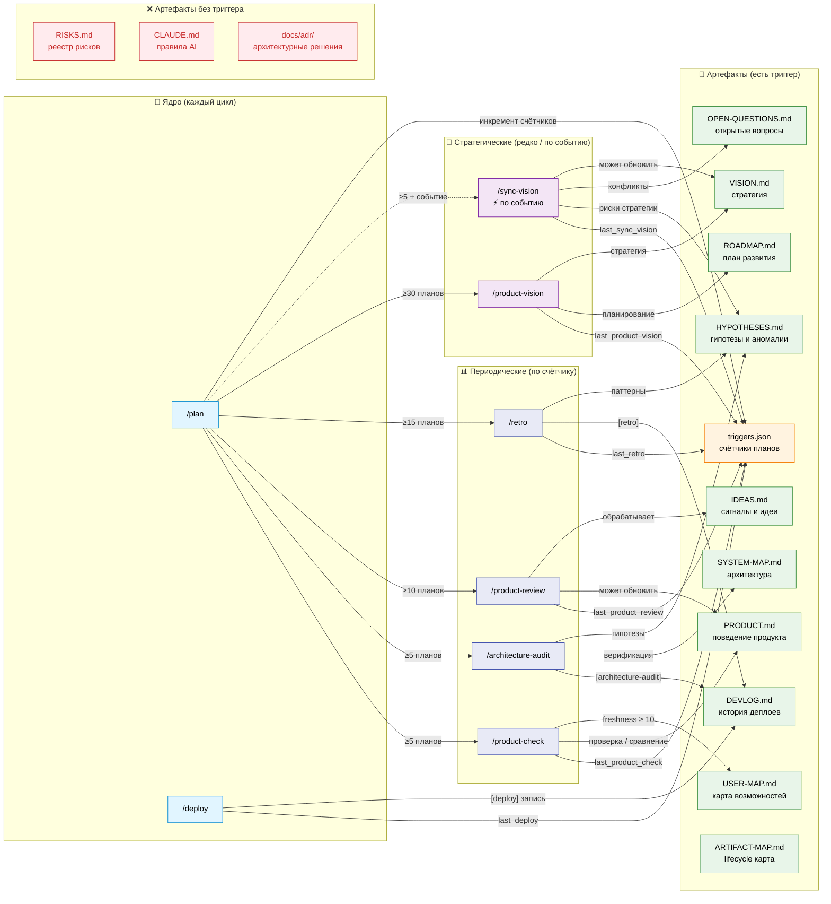

# ARTIFACT-MAP — methodology-platform

Карта **жизненного цикла артефактов**: какая команда обновляет какой файл, как часто, и где gap.
Дополняет [USER-MAP](USER-MAP.md) (что умеет пользователь) и [SYSTEM-MAP](../architecture/SYSTEM-MAP.md) (как устроено) слоем актуальности документов.

> **Не синхронизируется `sync-methodology.sh`.** Обновлять при: добавлении новой команды / артефакта; изменении частоты триггера.

---

## Диаграмма: команды → артефакты

Группировка команд по частоте. Цвета: синий/фиолетовый/пурпурный = частота · оранжевый = state · зелёный = артефакт с триггером · красный = gap.

---

## Command Reference

| Команда | Назначение | Частота | Обновляет |
|---|---|---|---|
| `/plan` | Анализ задачи: риски, архитектура, план до первой строки кода | 🔁 каждый цикл | `triggers.json` |
| `/deploy` | Публикация изменений + обязательная запись истории | 🔁 каждый цикл | `DEVLOG.md`, `triggers.json` |
| `/product-check` | Соответствие PRODUCT.md реальному поведению | 📊 ≥5 планов | `PRODUCT.md`, `USER-MAP.md` |
| `/architecture-audit` | Drift SYSTEM-MAP vs реальный код — ищет расхождения | 📊 ≥5 планов | `SYSTEM-MAP.md`, `HYPOTHESES.md`, `DEVLOG.md` |
| `/product-review` | Обработка накопленных IDEAS.md сигналов → решения | 📊 ≥10 планов | `IDEAS.md`, `PRODUCT.md` |
| `/retro` | Паттерны проблем за N планов — системные причины | 📊 ≥15 планов | `HYPOTHESES.md`, `DEVLOG.md` |
| `/sync-vision` | Стратегия vs реальность при изменении контрактов | ⚡ по событию | `VISION.md`, `OPEN-QUESTIONS.md`, `HYPOTHESES.md` |
| `/product-vision` | Стратегический обзор: VISION + ROADMAP обновление | 🔭 ≥30 планов | `VISION.md`, `ROADMAP.md` |

---

## Artifact Reference

| Артефакт | Назначение | Условие обновления | Частота | Gap |
|---|---|---|---|---|
| `triggers.json` | State-машина методологии: счётчики, даты, статус сессии | автоматически при каждом `/plan` и `/deploy` | 🔁 каждый цикл | ✅ |
| `DEVLOG.md` | Хронология проекта: деплои, решения, milestones | каждый деплой — обязательно | 🔁 каждый деплой | ✅ |
| `PRODUCT.md` | Спецификация поведения продукта с точки зрения пользователя | `last_product_check.plans_since ≥ 5` | 📊 ~5 планов | ✅ |
| `docs/product/USER-MAP.md` | Визуальная карта возможностей пользователей (Mermaid) | `last_user_map_sync.plans_since ≥ 10` или `[TODO:]` найдены | 📊 ~10 планов | ✅ |
| `docs/architecture/SYSTEM-MAP.md` | Архитектурная карта: компоненты, связи, границы модулей | `plans_since ≥ 5` | 📊 ~5 планов | ✅ |
| `HYPOTHESES.md` | Гипотезы о поведении системы, наблюдения, аномалии | при аудите / ретро / sync-vision | 📊 ~5–15 планов | ✅ |
| `OPEN-QUESTIONS.md` | Открытые вопросы, требующие решения команды или PM | при изменении контрактов | ⚡ по событию | ✅ |
| `IDEAS.md` | Сырые сигналы: боль пользователей, идеи, friction | `plans_since ≥ 10` или ≥ 7 unreviewed | 📊 ~10 планов | ✅ |
| `ROADMAP.md` | Стратегический план: что делаем и когда | `plans_since ≥ 30` | 🔭 ~30 планов | ✅ |
| `VISION.md` | Стратегические оси, долгосрочные цели продукта | `plans_since ≥ 30` или при контракт-изменениях | 🔭 ~30 планов | ✅ |
| `docs/product/ARTIFACT-MAP.md` | Lifecycle карта артефактов (этот файл) | при добавлении команды / артефакта | ручное | ✅ |
| **`RISKS.md`** | Реестр рисков: угрозы, вероятность, mitigation | **нет триггера** | — | ❌ |
| **`CLAUDE.md`** | Правила работы AI-агентов в проекте | **нет триггера** | — | ❌ |
| **`docs/adr/`** | Архитектурные решения и их обоснование | при новом решении; нет ревью старых | — | ❌ частично |

---

## Known gaps

| Gap | Риск | Возможное решение |
|---|---|---|
| `RISKS.md` без триггера | Риски устаревают незаметно — threat landscape меняется | Добавить в `/retro` или `/product-review` периодический check |
| `CLAUDE.md` без триггера | Правила могут расходиться с реальной практикой | Добавить в `/architecture-audit` или `/retro` check на устаревшие правила |
| `docs/adr/` без ревью устаревших | ADR от ранних фаз могут противоречить текущей архитектуре | Добавить в `/architecture-audit` проверку статусов ADR |

---

## Refresh Policy

Обновлять этот файл когда:
- Добавлена новая команда (`/X`) → добавить строку в Command Reference + node в диаграмму
- Добавлен новый тип артефакта → добавить строку в Artifact Reference
- Изменился порог триггера → обновить колонку "Частота" и subgraph label в диаграмме
- Gap закрыт → переместить из Stale в Live subgraph, обновить до ✅

`/review` проверяет: новая команда или артефакт → ARTIFACT-MAP обновлён?
