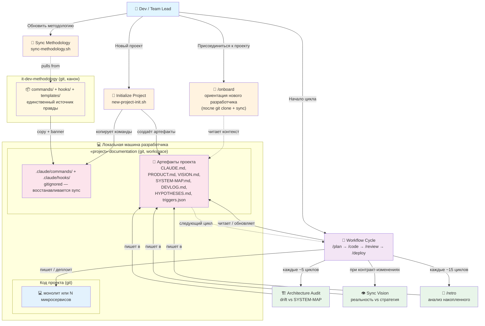

# USER-MAP — methodology-platform

**Variant A (Simple)** — что может делать пользователь/проект с методологией.

---

## Initial Setup

**Шаги инициализации (один раз на машину / после каждого clone):**

1. `git clone https://github.com/cait-solutions/it-dev-methodology` — склонируй методологию
2. `git clone <your-project-repo>` — склонируй проект
3. `bash it-dev-methodology/scripts/sync-methodology.sh <your-project>/` — восстанови команды локально
4. Открой `<your-project>/` в Claude Code как workspace root
5. Запусти `/onboard` (новый разработчик) или `/plan` (начало задачи)

> Команды синхронизируются в `.claude/commands/` но **не коммитятся** (gitignored).
> После каждого `git clone` нужно повторить шаг 3.

---

## Product Capabilities

---

## What Each Capability Does

| Capability | User Action | What Happens | Where Data Lives |
|---|---|---|---|
| **Initialize Project** | `new-project-init.sh <name>` | Creates full .claude structure, copies templates with banner, substitutes {{Project Name}}, initializes git | `.claude/{commands,agents,hooks,state}/` + root artifacts |
| **Onboard** | `/onboard` — после `git clone` + sync | Ориентирует нового разработчика: читает CLAUDE.md, PRODUCT.md, VISION.md, проверяет что workspace настроен | Читает из `project-docs/` — не создаёт новых данных |
| **Execute Workflow** | Runs `/plan` → `/code` → `/review` → `/deploy` in Claude Code | Manages plan approval, code review gates, self-lint checks, smoke tests, DEVLOG updates | `triggers.json` (state), DEVLOG.md (history) |
| **Sync Methodology** | `sync-methodology.sh <target>` | Updates commands/hooks with fresh banner, detects local edits, preserves project-owned content. **Also works as post-clone install** — if `commands/` absent (gitignored), creates it and restores from methodology | `.claude/commands/`, `.claude/hooks/`, `.claude/.version` |
| **Architecture Audit** | `/architecture-audit` (triggered ~every 5 plans) | Compares real code against SYSTEM-MAP (edges, components, layers) | Reports in DEVLOG, findings in HYPOTHESES.md |
| **Sync Vision** | `/sync-vision` (triggered when plan changes contracts) | Validates vision matches reality, classifies conflicts (A/B/C/D/E) | Reports in `docs/sync-vision-reports/`, updates OPEN-QUESTIONS.md |
| **Feedback Loop** | `/retro` (triggered every 15 plans), plus `/product-check`, `/product-review`, `/product-vision` | Analyzes skip-rates, detects repeated problems, validates product behavior, reviews backlog | DEVLOG.md (tagged entries), HYPOTHESES.md |

---

## Data Flow

1. **Bootstrap** → creates initial structure + artifacts template
2. **Workflow cycle** (plan/code/review/deploy) → increments `triggers.json` counters
3. **Periodic checks** (architecture-audit, sync-vision, retro) → triggered by counter thresholds
4. **Sync** → gets new commands/hooks from upstream, preserves local content. After `git clone` of consumer repo: commands gitignored → run sync to restore locally
5. **Feedback** → stored in DEVLOG + HYPOTHESES, informs next cycle

---

## Refresh Policy

USER-MAP updated when:
- New capability added (e.g., new slash-command category)
- Major workflow changed (e.g., new gate between /code and /review)
- New artifact type introduced (e.g., threat-model.md becomes standard)

USER-MAP NOT updated when:
- Internal refactor (no user-facing change)
- Command behavior tweaked (use PRODUCT.md for detail)
- Wording improvements

Trigger: See `.claude/state/triggers.json` — `last_user_map_sync.plans_since ≥ 10` + structural change detected.

---

## Notes

- This diagram shows **what methodology provides to users**, not how it's built internally (see SYSTEM-MAP for that)
- For new projects: This is **one possible USER-MAP**. Each project's USER-MAP will be different (ERP USER-MAP ≠ bot USER-MAP)
- For template-based projects: Use variant selection logic in [templates/USER-MAP.template.md](../../templates/USER-MAP.template.md)
