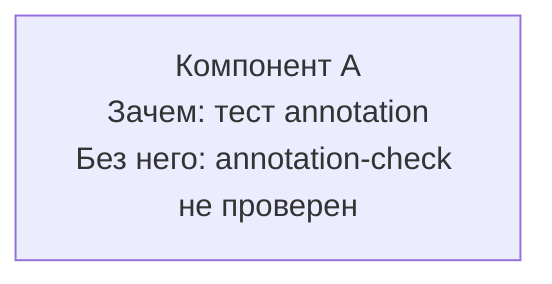

# Mermaid missing diagram-sources annotation — negative-fixture
# Назначение: mermaid-блок БЕЗ <!-- diagram-sources: ... --> сверху.
# Трипает: validate-maps-coverage.sh _scan_file_freshness:465 → _freshness_finding (WARN).
# Ожидаемый exit: 0 (severity=warn, не ERROR) — WARN в stdout.
# Харнес-статус: wave-2 (WARN-severity; assert_exit 1 невозможен без изменения DIAGRAM_FRESHNESS_SEVERITY).
# Также трипает validate-mermaid-links.sh MISSING_LINK → exit 1 (используется в harness wave-1).

