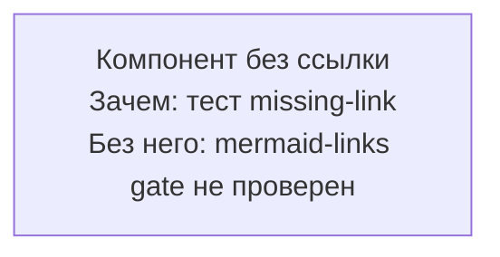

# Mermaid missing mermaid.live link — negative-fixture
# Назначение: mermaid-блок без https://mermaid.live ссылки в 5 строках выше.
# Трипает: validate-mermaid-links.sh MISSING_LINK:115 → errors += 1 → exit 1.
# Ожидаемый exit: 1.
# Используется в test-validators.sh harness (wave-1).

<!-- diagram-sources: none -->

