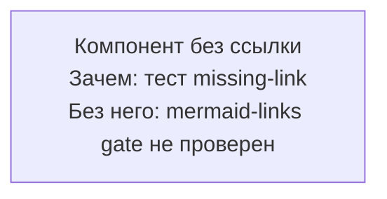

# Mermaid missing mermaid.live link — negative-fixture
# Назначение: mermaid-блок без https://mermaid.live ссылки в 5 строках выше.
# Трипает: validate-mermaid-links.sh MISSING_LINK:115 → errors += 1 → exit 1.
# Ожидаемый exit: 1.
# Используется в test-validators.sh harness (wave-1).

<!-- diagram-sources: none -->

https://mermaid.live/edit#pako:eNotjsFqwkAQhl9lmLOl90UKgm_Q3lwP22SNi9lENhtEgmBz6aGnngo-ha1IS9XkFWbfyDGRgWGY_5v_nwqjPNYocJbmq2iunIeXscwARhOJtKOGztRyv9CRLqEG-ubhF8Ib1wed6J_-hq_u8Ym-aB_eWTsLCDUdWa7BmqIwWfKQmmzRU5_dded2oEaA1c4qE3dEAYnyuhOB2rDl1B822t6SJU5xgHeav60k-rm2WqKQGOuZKlMvccOMKn3-vM4iFN6VeoDlMmbXsVGJU7Zfbq4cmXVd

