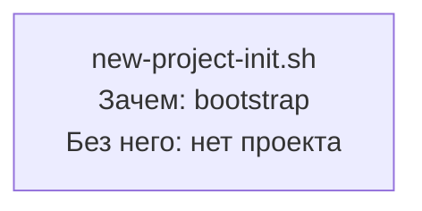

# USER-MAP — negative-fixture (scripts/fixtures/validators/)
# Назначение: намеренно содержит .sh-ноду в mermaid-блоке.
# Трипает: validate-maps-coverage.sh _check_user_map_no_scripts (USER_MAP_NO_SCRIPTS=gate) → exit 1.
# Ожидаемый exit: 1 (ERROR: script-node нарушает command-first инвариант).
# НЕ является реальной картой — только proof-of-rejection fixture.

