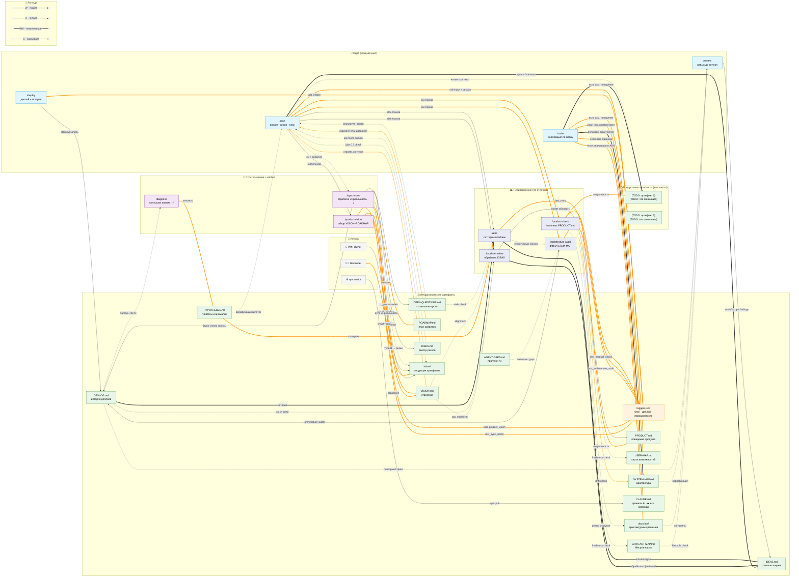

# ARTIFACT-MAP — {{Project Name}}

Карта **жизненного цикла артефактов**: какой документ описывает что в продукте, кто его обновляет и когда.
Дополняет [USER-MAP](USER-MAP.md) (что делает пользователь → потоки и outcomes) и [SYSTEM-MAP](../architecture/SYSTEM-MAP.md) (как устроено внутри) слоем **владения документами**.

ARTIFACT-MAP отвечает на вопрос **"какой документ описывает эту часть продукта, кто его владелец и когда он устаревает?"**

> ⚠️ Этот файл создаётся один раз при bootstrap с подстановкой `{{Project Name}}`. Не синхронизируется `sync-methodology.sh`. Проект владеет и поддерживает его самостоятельно.

---

> **⛔ Важно: эта карта описывает артефакты ПРОДУКТА, не процесса разработки.**
>
> **Продуктовые артефакты** — это документы о том что делает продукт: `orders.md`, `parties.md`, `invoice-flow.md`, `user-roles.md`. Именно их нужно заполнить в секции ниже.
>
> **Методологические артефакты** (DEVLOG.md, triggers.json, PRODUCT.md, VISION.md и т.д.) — уже присутствуют в стандартной части карты. Их не нужно изобретать заново.
>
> Если в карте есть только DEVLOG/triggers.json и нет документов специфичных для твоего продукта — **карта не заполнена**.
>
> **Исключение:** если продукт = методология/инструмент разработки — команды и шаблоны и есть product artifacts (см. пример methodology-platform).

---

## Bootstrap checklist

> Выполни эти шаги при первом заполнении карты после bootstrap.

- [ ] **Product artifacts заполнены:** секция "Продуктовые артефакты" содержит документы специфичные для твоего продукта (не только DEVLOG/triggers.json)
- [ ] **У каждого артефакта указан триггер обновления** (команда, CRUD-событие, или ручное + кто актор)

---

## Диаграмма: продуктовые артефакты ↔ команды

Цвета: зелёный = продуктовый артефакт · оранжевый = state · синий = ядро команд · фиолетовый = периодические · пурпурный = стратегические · серый = актор · розовый = бизнес-событие.
Стрелки: `-->` пишет (W) · `-.->` читает (R) · `===` читает+пишет (RW) · `--x` закрывает (C)

_(ссылка: запусти `bash scripts/update-mermaid-links.sh`)_

> **Легенда:** `-->` пишет (W) · `-.->` читает (R) · `===` читает+пишет (RW, оранжевый) · `--x` закрывает (C)

---

## Продуктовые артефакты (заполнить — это главная часть карты)

> **Откуда брать список артефактов:**
> 1. Открой `PRODUCT.md` — каждая ключевая сущность (orders, invoices, users, flows) должна иметь свой doc-артефакт
> 2. Пройди по всем файлам в `docs/` и корне проекта
> 3. **Для каждого артефакта обязательно указать триггер.** Ручное / CRUD / событийное — тоже триггер. Артефакт без триггера = документ который никто не поддерживает = устаревший.

> ⚠️ **Артефакт в этой карте = документ** который описывает сущность или процесс, не сама сущность.
> Для маркетплейса: `orders.md` = спецификация флоу заказов (lifecycle, статусы, правила); сама таблица `orders` — это данные, не артефакт.

**Примеры по типу проекта:**

| Тип проекта | Возможные doc-артефакты | Пишет / Актор | Читает | Закрывает |
|---|---|---|---|---|
| Маркетплейс | `docs/product/orders.md`, `docs/product/invoices.md`, `docs/product/catalog.md` | `/product-check`, `order.created` (CRUD) | Developer, PM | PM (статус deprecated) |
| ERP | `docs/product/parties.md`, `docs/product/contracts.md`, `docs/product/packages.md` | `/product-check`, Developer | Developer, PM | PM (сущность удалена) |
| CRM / продажи | `docs/product/customers.md`, `docs/product/pipelines.md` | `/product-review`, Owner | Developer, Owner | — |
| ИИ-бот / агент | `docs/product/prompts.md`, `docs/product/conversation-flows.md` | `/product-check`, Developer | Developer, `/review` | — |
| API-сервис | `docs/api-contracts.md`, `docs/rate-limits.md` | `/sync-vision`, Developer | Developer, `/review` | Developer (v-deprecated) |
| Внутренний инструмент | `docs/product/user-roles.md`, `docs/product/permissions.md` | `/product-check`, PM | Developer, PM | PM (роль удалена) |

| Артефакт | Назначение | Условие обновления | Пишет / Актор | Читает | Закрывает | Частота |
|---|---|---|---|---|---|---|
| `[TODO: артефакт]` | `[TODO: что описывает из PRODUCT.md]` | `[TODO: когда обновлять]` | `[TODO: актор / команда]` | `[TODO: кто читает]` | `[TODO: кто закрывает или —]` | `[TODO: частота]` |

---

## Методологические артефакты (стандартные — не нужно изобретать)

Эти артефакты приходят с методологией. Заполнять не нужно — они уже описаны.
Добавляй строки только если их поведение в твоём проекте отличается от стандартного.

| Артефакт | Назначение | Условие обновления | Пишет / Актор | Читает | Закрывает | Частота |
|---|---|---|---|---|---|---|
| `triggers.json` | State-машина методологии: счётчики, даты, статус сессии | автоматически при каждом `/plan` и `/deploy` | `/plan`, `/deploy` | все команды (state check) | — | 🔁 каждый цикл |
| `DEVLOG.md` | Хронология проекта: деплои, решения, milestones | каждый деплой — обязательно | `/deploy`, `/architecture-audit`, `/sync-vision` | `/retro`, `/review`, `/product-vision` | — | 🔁 каждый деплой |
| `PRODUCT.md` | Спецификация поведения продукта с точки зрения пользователя | `last_product_check.plans_since ≥ 5` | `/product-check`, `/product-review`, `/code` | `/plan`, `/product-check`, `/code` | — | 📊 ~5 планов |
| `docs/product/USER-MAP.md` | Визуальная карта возможностей пользователей (Mermaid) | `last_user_map_sync.plans_since ≥ 10` или `[TODO:]` найдены | `/code` | `/product-check`, `/code`, Developer, PM/Owner | — | 📊 ~10 планов |
| `docs/architecture/SYSTEM-MAP.md` | Архитектурная карта: компоненты, связи, границы модулей | `plans_since ≥ 5` | `/code` | `/review`, `/architecture-audit`, `/code`, Developer | — | 📊 ~5 планов |
| `HYPOTHESES.md` | Гипотезы о поведении системы, наблюдения, аномалии | при ретро / диагностике | `/retro`, `/diagnose` | `/plan` (Шаг -1.5), `/retro` | — | 📊 ~5–15 планов |
| `AGENT-GAPS.md` | Лог признанных пропусков / ошибок AI | при явном признании ошибки AI (триггер -4 в `/plan`) | `/plan` (Шаг -4), `/code`, `/review`, AI Agent | `/architecture-audit`, `/retro` | — | ⚡ по событию |
| `OPEN-QUESTIONS.md` | Открытые вопросы, требующие решения команды или PM | при изменении контрактов | `/sync-vision`, `/plan` | `/plan` (Шаг -3.3), `/retro`, PM/Owner | PM / Owner | ⚡ по событию |
| `inbox/` | Очередь внешних входящих документов: VCD, specs, анализы | при получении внешнего документа | PM / Owner / Developer | `/plan` (Шаг 0.7), `/sync-vision` | `/sync-vision`, `/plan` → `_processed/` | ⚡ по событию |
| `IDEAS.md` | Сырые сигналы: боль пользователей, идеи, friction | `plans_since ≥ 10` или ≥ 7 unreviewed | `/plan`, `/review`, `/retro` | `/product-review`, `/plan` (Шаг 1.6), `/retro` (Шаг 6) | `/product-review` | 📊 ~10 планов |
| `ROADMAP.md` | Стратегический план: что делаем и когда | `plans_since ≥ 30` | `/product-vision` | `/plan` (Шаг 1.5), Developer, PM/Owner | — | 🔭 ~30 планов |
| `VISION.md` | Стратегические оси, долгосрочные цели продукта | `plans_since ≥ 30` или при контракт-изменениях | `/product-vision`, `/sync-vision` | `/plan`, `/product-review`, `/sync-vision` | — | 🔭 ~30 планов |
| `docs/product/ARTIFACT-MAP.md` | Lifecycle карта артефактов (этот файл) | при добавлении команды / артефакта / актора | Developer | Developer, `/review` | — | ручное |
| `RISKS.md` | Реестр рисков: угрозы, вероятность, mitigation | при новом риске или по рекомендации `/retro` | `/sync-vision` (Type B), PM / Owner | `/plan`, PM/Owner, Developer | PM / Owner | 📊 ~15 планов |
| `CLAUDE.md` | Правила работы AI-агентов в проекте | при sync pull или изменении правил | `/code`, sync-script | все команды (rules) | — | ⚡ по событию |
| `docs/adr/` | Архитектурные решения и их обоснование | при архитектурном решении | `/code` | `/review` (Шаг 2), `/architecture-audit`, `/sync-vision`, `/code` | Developer (deprecated) | ⚡ по решению |

### Проектные команды (если есть)

Если в проекте есть дополнительные команды (cron-jobs, миграции, sync-скрипты) — добавь их сюда.

| Команда / Скрипт | Назначение | Частота | Обновляет |
|---|---|---|---|
| `[TODO: команда]` | `[TODO: что делает]` | `[TODO: частота]` | `[TODO: артефакты]` |
| *Пример маркетплейс:* `bash sync-catalog.sh` | Синхронизирует каталог товаров с внешним поставщиком | по расписанию / вручную | `docs/product/catalog.md` |

---

## Ручные триггеры (риск пропуска)

> **Правило: у каждого артефакта есть триггер.** Ручное обновление тоже триггер: укажи кто и при каком событии. Артефакт без триггера = документ который никто не поддерживает = устаревший.

| Артефакт | Триггер | Актор | Риск если не обновлять |
|---|---|---|---|
| `RISKS.md` | `/retro` (паттерны) или новый риск | PM / Owner | Устаревший threat landscape |
| `CLAUDE.md` | sync pull или изменение правил | Developer (запускает sync-script) | Правила расходятся с практикой |
| `docs/adr/` | архитектурное решение или `/architecture-audit` | Developer (запускает `/code`) | ADR противоречат текущей архитектуре |
| `inbox/` | Получен новый внешний документ | PM / Owner / Developer | Документ не обработан → план и sync-vision работают с устаревшими данными |
| `[TODO: продуктовый артефакт]` | `[TODO: триггер]` | `[TODO: актор]` | `[TODO: риск]` |

---

## Refresh Policy

Обновлять этот файл когда:
- Добавлена новая сущность продукта (новый flow, новый тип документа) → добавить строку в "Продуктовые артефакты" + node в диаграмму
- Добавлена новая команда (`/X`) → добавить строку в таблицу команд + node в диаграмму + двустрочный label
- Появился новый актор (Developer, PM, скрипт, CRUD-событие) → добавить в Actors / Events subgraph
- Изменился порог триггера → обновить колонку "Частота" и стрелку Plan→команда в диаграмме
- Ручной триггер автоматизирован → убрать из "Ручные триггеры", обновить Актор в таблице
- Артефакт без входящих стрелок (`-->`, `===`) И с `Читает = —` → кандидат на рудимент: проверить при `/retro`
- Изменён тип связи (W→RW) → заменить `-->` + `-.->` на `===`

**Принцип диаграммы: продуктовые артефакты — первичны.**
Диаграмма показывает прежде всего как команды обновляют **документы продукта**. Методологические артефакты (DEVLOG, triggers.json и т.д.) — вторичный слой.

**Checklist перед коммитом этого файла:**
- [ ] Bootstrap checklist заполнен (продуктовые артефакты + триггеры)
- [ ] Каждая **команда** в "Читает" → есть `-.->` или `===` стрелка в диаграмме
- [ ] Каждый "Пишет / Актор" → есть `-->` или `===` стрелка в диаграмме
      **ИСКЛЮЧЕНИЕ:** human actors (Developer / PM / Owner) без `inbox` — ручное ownership, не показывается в диаграмме
- [ ] Если команда одновременно в "Пишет" И "Читает" → используется `===`, не две стрелки
- [ ] Нет нод без единой стрелки (входящей или исходящей)
- [ ] Каждая стрелка в диаграмме → соответствующая строка в таблице
- [ ] Command-ноды в диаграмме имеют двустрочный формат: `["/command описание"]` (описание ≤ 30 символов)

`/review` проверяет: новый продуктовый артефакт добавлен → Bootstrap checklist обновлён? table↔Mermaid консистентны?
