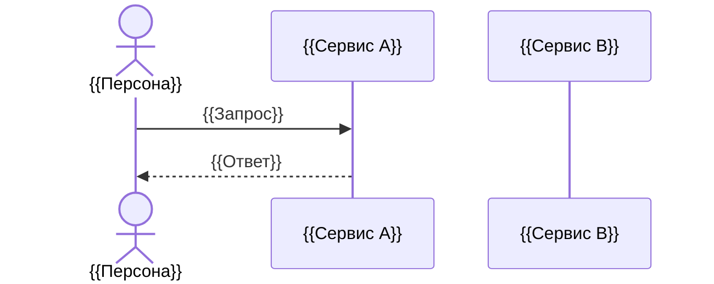

# {{Feature}} Design Spec — {{service-name}}

> **Статус:** Draft | Final
> **Связанные ADR:** (список ADR которые приняли решения по этой фиче)
> **Связанный /plan:** (task-id из triggers.json)

---

## 1. Цель и ценность

> Описывает весь эпик/фичу, а не только последнее изменение. Одним абзацем: какую бизнес-задачу решает, кому нужна, какой результат.

{{Опиши бизнес-цель: что система должна уметь делать и почему это важно.}}

---

## 2. Согласованные требования

> Каждый пункт: **Описание** (что) + **Аргументация** (за счёт чего, механизм, отвергнутые альтернативы) + **Пример** (однострочный сценарий).

### 2.1. {{Компонент / подфича}}

- **Описание:** {{Полное предложение что система делает.}}
- **Аргументация:** {{За счёт чего; механизм реализации; почему именно так, а не иначе; отвергнутые альтернативы.}}
- **Пример:** {{Однострочный сценарий: "Менеджер делает X → система делает Y → результат Z."}}

### 2.2. {{Компонент / подфича}}

- **Описание:** {{...}}
- **Аргументация:** {{...}}
- **Пример:** {{...}}

<!-- Добавляй секции 2.N по мере наполнения -->

---

## 3. Ограничения и допущения

> Технические или бизнес-ограничения которые влияют на дизайн. Внешние зависимости (сервисы, стандарты, легаси).

- {{Ограничение 1 — почему оно существует.}}
- {{Зависимость от внешней системы / стандарта.}}
- {{Допущение которое должно быть истиной для работы фичи.}}

---

## 4. Не в scope (явный список)

> Что явно **не** покрывает этот дизайн. Позволяет читателю не гадать о границах.

- {{Что не входит — и почему (другой ADR / другой сервис / V2).}}
- {{Что намеренно отложено с причиной.}}

---

## 5. Приоритеты реализации

> Порядок если реализация поэтапная. MVP → Advanced.

1. **{{Этап 1 / MVP}}:** {{Что входит в минимальную версию.}}
2. **{{Этап 2}}:** {{Что добавляется во второй итерации.}}

---

## 6. Открытые вопросы (Open Questions)

> Вопросы требующие решения PM или архитектора до/во время реализации.

| ID | Вопрос | Ответственный | Статус |
|---|---|---|---|
| OQ-1 | {{Вопрос}} | PM / Arch | Open |

---

## 7. Legacy details

> При обновлении документа — важные детали из предыдущих версий сохраняются здесь (Anti-Loss принцип). Не удалять без явного решения PO.

<!-- Перемещай сюда устаревший контент при обновлении секций выше -->

---

## 8. Сквозной сценарий (Happy Path)

> **Опциональная секция.** Рекомендована для: сложных механизмов с несколькими взаимодействующими компонентами, презентаций PO/stakeholder, онбординга новых разработчиков.
> Цель: показать как все механизмы §2 работают в связке за один проход — от триггера до результата.

**Персона:** {{Роль пользователя, контекст — например: «Иван, рефарбишер, продаёт через маркетплейс»}}

### 8.1 Нарратив

> Пошаговый текст на естественном языке. Каждый шаг — одно действие или одно решение системы.
> Термины расшифровывать **один раз** при первом упоминании в скобках — далее использовать без пояснений.
> Покрыть: начало → ключевые механизмы → граничный случай → завершение.

**Шаг 1 — {{Действие пользователя}}**

{{Описание. Новые термины — в скобках при первом упоминании.}}

**Шаг 2 — {{Следующее действие или реакция системы}}**

{{...}}

<!-- Добавляй шаги до полного покрытия happy path -->

---

### 8.2 User Flow (для PO и презентаций)

> Mermaid flowchart — простой язык, визуальный путь пользователя. Без технических деталей реализации.
> Генерировать ссылку через: `bash scripts/update-mermaid-links.sh <path-to-this-file>`

https://mermaid.live/edit#pako:PLACEHOLDER_FLOW

```mermaid
flowchart TD
    A([👤 {{Персона}} начинает]) --> B[{{Шаг 1}}]
    B --> C{{{Ветвление}}}
    C -->|Да| D[{{Результат A}}]
    C -->|Нет| E[{{Результат B}}]
    D --> F([✅ {{Завершение}}])
```

---

### 8.3 Sequence Diagram (для разработчиков)

> Mermaid sequenceDiagram — технический уровень: сервисы, вызовы, порядок.
> Генерировать ссылку через: `bash scripts/update-mermaid-links.sh <path-to-this-file>`

https://mermaid.live/edit#pako:PLACEHOLDER_SEQ



---

---
Previous v. 0.0 = 0 characters
New v. 1.0 = {{N}} characters

Краткое описание изменений: Initial draft.
