# ROADMAP — {{Project Name}}

Решения принимает владелец продукта. Этот файл — инструмент приоритизации, не очередь задач.

Обновляется после `/vision review`, `/vision strategy` и подтверждённого `/plan`. Не обновляется автоматически.

---

## Структура разделов

| Раздел | Что значит |
|---|---|
| **Now** | В работе прямо сейчас |
| **Next** | Подтверждено, не начато |
| **Considered** | Предложено, требует решения PM |
| **On hold** | Хорошая идея, ждёт данных или внешнего условия |
| **Arch review** | Требует `/plan` Шаг 1.7 (контракт с внешним миром) перед решением |
| **Rejected** | Рассмотрено, отклонено — с причиной чтобы не возвращаться |
| **Done** | Завершено — переезжает сюда после деплоя |

---

## Now

*Что в работе прямо сейчас. Каждая запись с горизонтом завершения.*

---

## Next

*Подтверждено владельцем, не начато. Готово к старту следующей итерации.*

---

## Considered

### High

*Высокий приоритет — рассмотреть в ближайшие итерации. Привязка к конкретным сигналам из IDEAS.md обязательна.*

### Medium

*Средний приоритет.*

### Low

*Низкий приоритет / исследовательские задачи.*

### Из VISION.md → Ось N: <Название оси> `[feat:axis-tag]`

*Задачи привязанные к стратегическим осям из VISION.md. Один блок на ось.*

---

## On hold

*Что ждёт условия (данные, тренд, решение по смежной задаче). Указывать что конкретно разблокирует:*

- *Ждёт: ...*

---

## Arch review

*Идеи требующие проработки контракта с внешним миром (`/plan` Шаг 1.7) перед принятием решения.*

*Открытые вопросы: ...*

---

## Rejected

*Первый Rejected должен содержать причину чтобы не возвращаться к идее. Без причины — не отклонено.*

---

## Done

*Реализованные milestone-задачи с датой завершения. Пример формата:*

| Задача | Дата | Результат |
|---|---|---|
| | | |

---

## Визуальный roadmap

> **Формат:** мermaid-диаграмма + URL над блоком (вставляется `update-mermaid-links.sh` — не редактировать URL вручную).
> **Одна диаграмма** — все статусы с цветовым кодом. Rejected — не показывать (anti-memory).
> **Collapse-политика Done:** последние 1-2 done-записи — отдельный нод; остальные — blob «✅ Done N задач → таблица Done».
> **PR-coupling:** обновить диаграмму в том же commit что и изменение секций. Рефакторинг / опечатки — не обновлять.
> **Refresh:** после каждого `/vision review`, `/vision strategy`, подтверждённого `/plan` (только при добавлении/изменении/закрытии узлов).
> **Stale-detection:** `validate-mermaid-links.sh` проверяет freshness URL. Пересобрать: `bash scripts/update-mermaid-links.sh <файл>`.

<!-- mermaid-link-placeholder -->

https://mermaid.live/edit#pako:eNqlVt1qG0cUfpVhTSABbSLtai15MYI2CnXAli6S0pQqF7O7M5XoSmtWq6QmCdgOcQpua_IDCaXF7W2v1NYbKY2tvsLMK_gJ-gg9Z3a1ktZqCK0E0uzM-c75vjk_0gPNDTym2dqXId1uk9v1Vo_Ay_Vpv19nnHhBjxHe8X17pVS2TMMr9KMw-IrZK4bhWhYruIEfhPaK53KXVXLgXnB_imUmrdIMu1qkFqcZ1mGUszyWfR2l4KJbpqssA5tVx-PVKZgVuXEB3O6k0ErJ5CUjgzLqmMUMyhlfc80ctMu8KbZqWkWeYbm1xorOHNZ083r9TK9ZKZesUoZdc6lJeUbZYhXm5CkH_jRwiRtrZmV2WU7FqBan4NRVcqh7tN-mYUh3bIvklVDOg9CjPXeaQNMpVlbLmV9atSxeyQSZrMqX-C2j38TzpUtE13UiXomh-F3Ecld-I5-JM3hPRIxHmVkdquZjP3C-aGnnPz5Rj0SciAm5d-fq5zZpEDECHydiKJ-uO-G12mXxF_h4B56G8oiIsdyT-2Iid2F1RM53XxJ4HIrfwGIsD8RQObzS0u7ato0FmsUVr9GEoDe5B8sYYpyJMbAr6YaqZV2xPZGH9gLZUsp0XfwEgUYgb5gCFdO82rdzAsS4pjTgDjzF4tQm6_IpCiDyO_WFhsBmUpunvHinzwmoRYkTQMQE2MfiLbgbyr2Fm20E95Hr38cvY9JofnaR8DIyB7B4J79Nw0NX5qMfqzvZT3SKN8A3Rp0FAp8xUWlBKqhlgQz0aMpmRBo37tz-T3TASY7P9aDX73gsZJ5NNm5-skG2w04QdqKdhejXk9DHvyQ2HxxapRArLKPQ7ryHwNaN-s1Pt5ZT2Eop_IxW_4cBTJ33UNiERC-Nv6nq9odflcWHhIdtyK08SsP6F0qh2Usm0XyUDRXlaEyaDbLR3Px3oVA48pncR5mPVf9NwASbSNX2SDXwRPwJTbyrjmA1zQDEzDH5aDa-cAJgESpvf4CcAzUYLifVeYrFiyWFfiHw93KfgOsJHOBUOcMLh6s-vDITdcsNtllzEKnsvThMGgDGjzzE1sYWRKJvklSpzT4iyPnBc3JNLfVgECXUZ2N2-ZyEYQasT5OEw3CCWYeDDXZwpsyzmhucsFlTvb7Q-ES_qtcetjQ1ePZQ5onKAFKMW9pDaIm57sisRzMeiAF5ytbQClqXhV3a8eD3_0FLi9qsy1qa3dI8xunAB4GPwIYOouDWTs_V7CgcsII22PZoxOodCn8Zusnmo38AvjGh3Q

```mermaid
graph TD
    classDef done fill:#14532d,stroke:#22c55e,color:#dcfce7
    classDef now fill:#1e3a8a,stroke:#60a5fa,color:#dbeafe
    classDef next fill:#0c4a6e,stroke:#38bdf8,color:#e0f2fe
    classDef hi fill:#713f12,stroke:#eab308,color:#fef9c3
    classDef med fill:#78350f,stroke:#f59e0b,color:#fef3c7
    classDef low fill:#374151,stroke:#9ca3af,color:#e5e7eb
    classDef hold fill:#1f2937,stroke:#6b7280,color:#9ca3af,stroke-dasharray:5 3
    classDef affordance fill:#3b0764,stroke:#a855f7,color:#f3e8ff,stroke-dasharray:4 3

    %% --- Завершённое ---
    %% DoneBlob["✅ Done до vX.Y: N задач<br/>(полная история — таблица Done)"]:::done
    %% Или последние 1-2 done-ноды:
    %% Done1["✅ <Название завершённой задачи><br/>зачем: <что это дало>"]:::done

    %% --- В работе сейчас ---
    %% Now1["🔵 NOW <Название><br/>зачем: <цель>"]:::now

    %% --- Подтверждено, не начато ---
    %% Next1["🔷 NEXT <Название><br/>зачем: <цель>"]:::next

    %% --- Considered: HIGH priority ---
    %% C1["🟡 HIGH <Название><br/>зачем: <ценность>"]:::hi

    %% --- Considered: MEDIUM priority ---
    %% M1["🟠 MED <Название><br/>зачем: <ценность>"]:::med

    %% --- Considered: LOW priority ---
    %% L1["⚪ LOW <Название><br/>зачем: <идея>"]:::low

    %% --- On hold ---
    %% H1["⏸ ON HOLD <Название><br/>ждёт: <условие разблокировки>"]:::hold

    %% --- Affordance — навигация (не моделируют компоненты) ---
    ScopeOut["📋 Полный отложенный scope → /scope-out"]:::affordance

    %% --- Зависимости (примеры) ---
    %% DoneBlob --> Now1
    %% Now1 -.->|"даст данные"| C1
    %% C1 -.->|"зависит от"| C2
```



**Правила нодов:**
- Формат label: строка 1 = эмодзи статуса + название; строка 2 = `зачем: <цель>` (через `<br/>`)
- Зависимости: `-->` жёсткая · `-.->` мягкая / «даст данные для» · label на стрелке кратко
- ~15-20 нодов максимум; детали — в таблицах секций выше

---

## Формат записи (Considered / Next / Now)

```
- **<Краткое название>** — <описание задачи, чем больше деталей тем меньше додумывать>.
  *Источник:* IDEAS.md YYYY-MM-DD / план / /vision review / /vision strategy.
  *Горизонт:* недели или месяцы (опционально для High).
  *Требует:* /plan шаги X.Y если применимо.
```

---

## Принципы

- **Не очередь задач** — это приоритизация. Конкретный план — в `/plan` → плановый документ.
- **Привязка к данным** — High/Medium должны ссылаться на конкретный сигнал в IDEAS / DEVLOG. Без привязки — не High.
- **Rejected фиксирует причину** — чтобы через 3 месяца не предлагали то же самое.
- **Done растёт навсегда** — это история продукта, не временный список.
