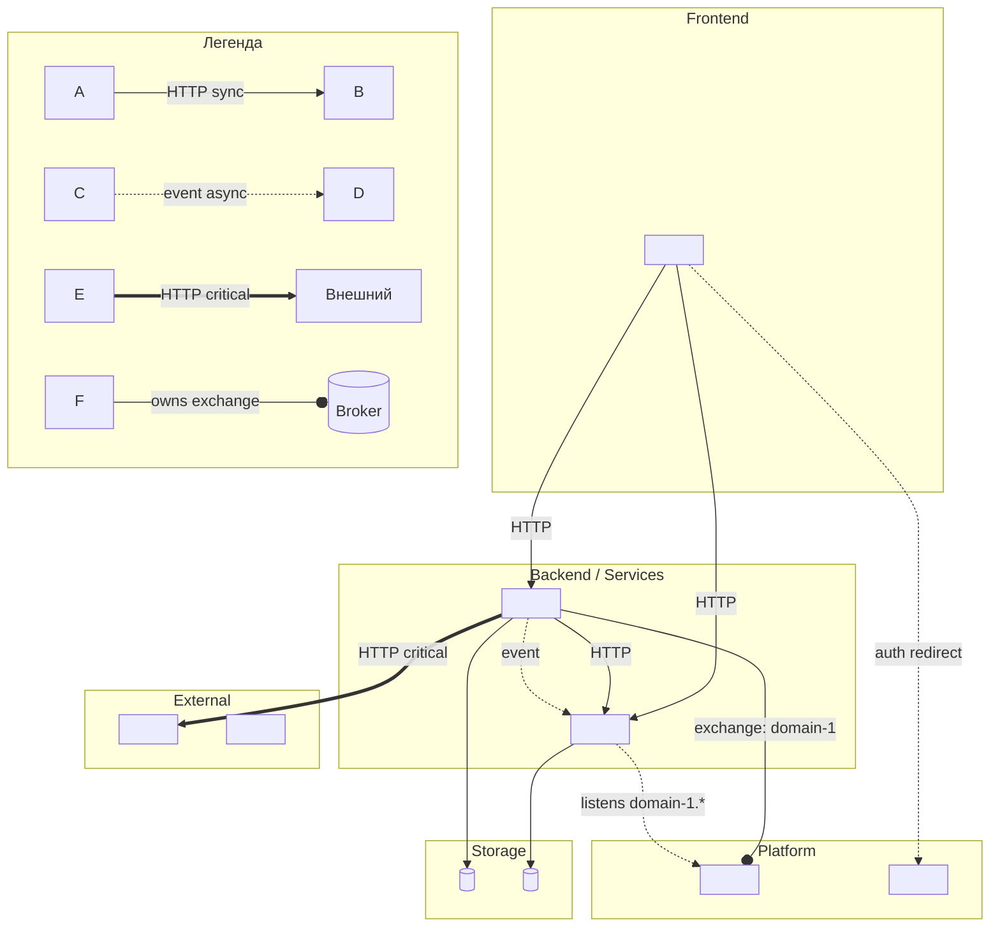

# SYSTEM-MAP — {{Project Name}}

**Версия:** v0.1
**Обновлён:** YYYY-MM-DD
**Граф проверен против кода:** YYYY-MM-DD

> Обновлять этот файл в том же PR что и изменения коммуникации между компонентами, владения данными или внешних интеграций. См. CLAUDE.md.
>
> Дрейфа аудит: запускать `/architecture-audit` ежеквартально или перед крупным планированием.

---

## Agent TL;DR

<!-- 5-15 строк scan-friendly резюме. Что в графе, основные подсистемы, критичные edges, известные gap-ы. Агент читает эту секцию первой при анализе архитектурных задач. -->

- **Основные подсистемы:** <2-5 групп компонентов — например "Frontend / Master Data / Operations / Reporting">
- **Источники правды:** <какие компоненты владеют какими данными — high-level>
- **Критичные edges:** <какие коммуникации нельзя ломать — например "HTTP critical" в графе>
- **Известные gap-ы:** <Outbox / auth / monitoring — что недореализовано; см. RISKS.md для деталей>
- **На что обратить внимание при `/plan [data]` или `[contract]`:** <где чаще всего меняются контракты>

---

## Граф системы

**Легенда:**
- `-->` HTTP синхронный вызов
- `-.->` Асинхронное событие через очередь
- `==>` HTTP критичный (без него не работает основной флоу)
- `--o` Сервис владеет exchange / очередью

---

## Компоненты

Для каждого активного компонента — короткая карточка.

### `<service-name>`

- **Назначение:** одной фразой что делает
- **Владелец:** команда или человек
- **Стек:** язык, фреймворк, ключевые библиотеки
- **Точки входа:** основные API / роуты / интерфейсы
- **Зависимости:** что вызывает / что вызывают
- **Хранилища:** какие БД/кэши пишет, какие читает (детали — в `docs/data-map.md`)
- **События:** publisher / subscriber (если применимо)
- **Repo / путь:** где найти код

---

## Внешние зависимости

| Сервис | Назначение | Владелец | SLA / тариф | Где задокументирован контракт |
|---|---|---|---|---|
| | | | | |

---

## Инфраструктура

- **Cloud provider:**
- **Регионы:**
- **CI/CD:**
- **Secrets management:**
- **Monitoring:**
- **Logging:**
- **Incident response:** <runbook link>

---

## Известные пробелы и техдолг

Архитектурные gap-ы и техдолг которые видны на уровне карты (детали — в RISKS.md):

- <gap 1 — например "Outbox не реализован, события публикуются напрямую">
- <gap 2>

---

## Изменения карты

Изменения фиксируются в git history этого файла.
Крупные архитектурные решения — в `docs/adr/` (если используется ADR).
Аудит на дрейф: `/architecture-audit` (результат → DEVLOG.md с тегом `[architecture-audit]`).
