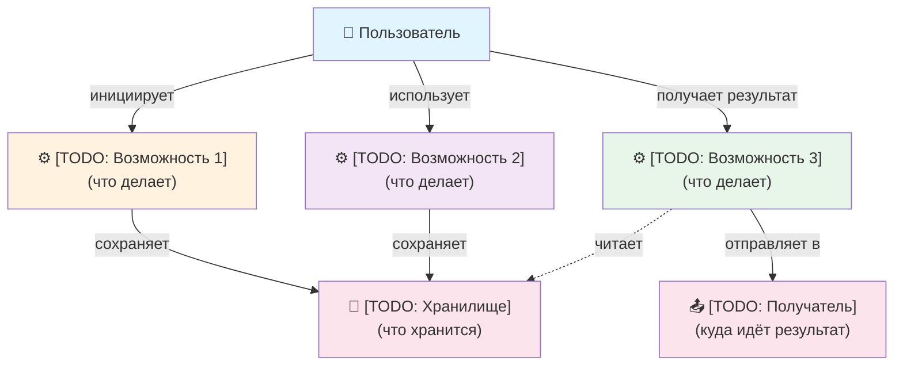
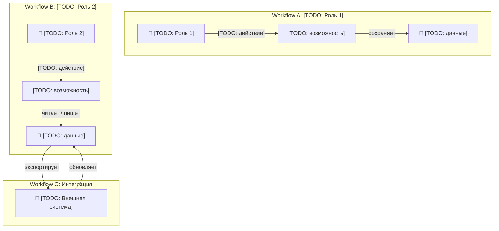
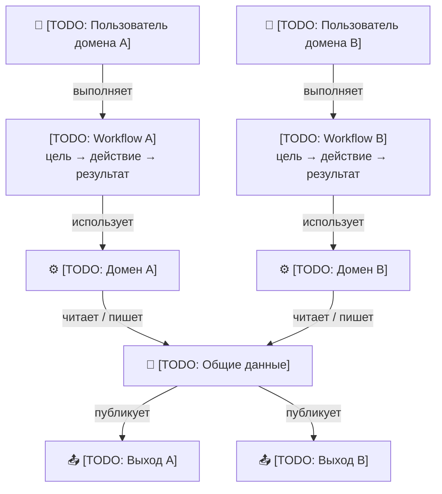

# USER-MAP — {{Project Name}}

Карта **что могут делать пользователи продукта** — функциональные возможности с их точки зрения.
Дополняет [SYSTEM-MAP](../docs/architecture/SYSTEM-MAP.md) (внутренняя архитектура) внешним взглядом.

> ⚠️ Этот файл создаётся один раз при bootstrap с подстановкой `{{Project Name}}`. Не синхронизируется `sync-methodology.sh`. Проект владеет и поддерживает его самостоятельно.

---

## Требования к диаграммам

**Mermaid обязателен.** USER-MAP (как и SYSTEM-MAP) всегда содержит Mermaid-диаграмму. Замена на ASCII/текст запрещена.

**Все стрелки подписаны.** Стрелка без метки — неоднозначность. Каждая связь объясняет что происходит.

**Гибридный язык (EN + RU):**
- EN: технические термины, имена команд, файлов, API
- RU: описания действий, аннотации, поведение

**Типы стрелок:** `-->` сплошная — активное действие; `-.->` пунктирная — чтение / пассивная связь.

**Формат subgraph labels:** `<emoji> <name> (<type>, <role>)`
- 📦 канон / source-of-truth · 📂 docs/workspace · 💻 code repos · ☁️ remote · 💻 local machine
- Платформа `(GitHub / GitLab)` — только на Remote subgraph, один раз для всех repo
- Локальные клоны: `(git, role)` — без указания платформы

---

## Легенда

| Элемент | Тип узла |
|---|---|
| 👤 | Актор (пользователь, роль) |
| 📦 | Источник данных / хранилище |
| ⚙️ | Процесс / обработка |
| 💾 | Персистентное хранилище |
| 📤 | Выход / получатель результата |
| 🔌 | Внешняя система / интеграция |

---

## Как выбрать вариант

| Вариант | Когда | Структура |
|---------|-------|-----------|
| **A (Simple)** | До 5 возможностей, одна роль | Дерево возможностей |
| **B (Medium)** | Несколько ролей с разными workflow | Workflow по ролям + матрица |
| **C (Complex)** | 10+ возможностей, несколько доменов | Три уровня: workflow + домены + данные |

Если не уверен — **начни с Variant A**. Эволюция: A → B → C по мере роста.

---

## Variant A — Simple



**Замени `[TODO: ...]` на реальный контент проекта, затем удали `[TODO: ...]`:**

| Placeholder | Примеры замены |
|---|---|
| Возможность 1, 2, 3 | "Создать задачу", "Оформить заказ", "Сгенерировать отчёт" |
| Хранилище | "БД задач", "Корзина + история заказов", "Файловое хранилище" |
| Получатель | "Telegram-чат", "Email пользователя", "Внешний API" |

---

## Variant B — Medium (несколько ролей)



**Матрица ролей:**

| Возможность | [TODO: Роль 1] | [TODO: Роль 2] | Внешняя система |
|---|---|---|---|
| [TODO: действие A] | ✓ | ✗ | ✗ |
| [TODO: действие B] | ✓ | ✓ (свои) | ✓ (API) |

---

## Variant C — Complex (multi-domain)



---

## Node Vocabulary

Закрепи имена ключевых концепций проекта и используй их везде — в USER-MAP, SYSTEM-MAP, PRODUCT.md, DEVLOG. Синонимы создают путаницу при поиске.

```
| Каноническое имя  | Не использовать        |
|-------------------|------------------------|
| [TODO: имя 1]     | [TODO: синонимы]       |
| [TODO: имя 2]     | [TODO: синонимы]       |
```

Пример (ERP): `Товар` — не "product", "артикул", "item". `Заказ` — не "order", "сделка".

---

## Refresh Policy

**Обновлять USER-MAP когда:**
- Добавлена новая крупная возможность продукта
- Изменился workflow между возможностями
- Новый тип пользователя с отдельным workflow
- Изменился получатель результата

**Не обновлять при:** рефакторинге, багфиксах, улучшении производительности.

**Активные триггеры:**
- `/product-check` (шаг 7) — проверяет `last_user_map_sync.plans_since ≥ 10` и наличие `[TODO: ...]`
- `/onboard` — проверяет `[TODO: ...]` при каждом запуске
- `/plan` шаг -3 — инкрементирует `last_user_map_sync.plans_since`

---

## Bootstrap

При запуске `new-project-init.sh`:
1. Файл копируется в `docs/product/USER-MAP.md`, `{{Project Name}}` подставляется автоматически
2. Выбери вариант (начни с A)
3. Замени все `[TODO: ...]` на реальный контент
4. Удали `[TODO: ...]` метки после заполнения
5. PRODUCT.md — детальное поведение; USER-MAP — верхний уровень

> `/onboard` проверяет наличие `[TODO: ...]` в USER-MAP и предупреждает если они остались.
> `/product-check` проверяет свежесть USER-MAP через `triggers.json → last_user_map_sync`.

---

## Notes

- USER-MAP = **что умеет пользователь продукта**; SYSTEM-MAP = как оно устроено внутри
  - ✅ "Создать задачу", "Оформить заказ", "Получить отчёт"
  - ❌ "REST endpoint", "Async queue", "database connection" — внутренняя реализация
- Диаграммы максимум **2-3 уровня глубины** — детали идут в PRODUCT.md
- **Исключение:** если пользователи продукта — сами разработчики (например, methodology-platform), USER-MAP может показывать dev workflow, repo-структуру и slash-команды — это и есть их product capabilities. См. `docs/product/USER-MAP.md` этого репо как пример.
