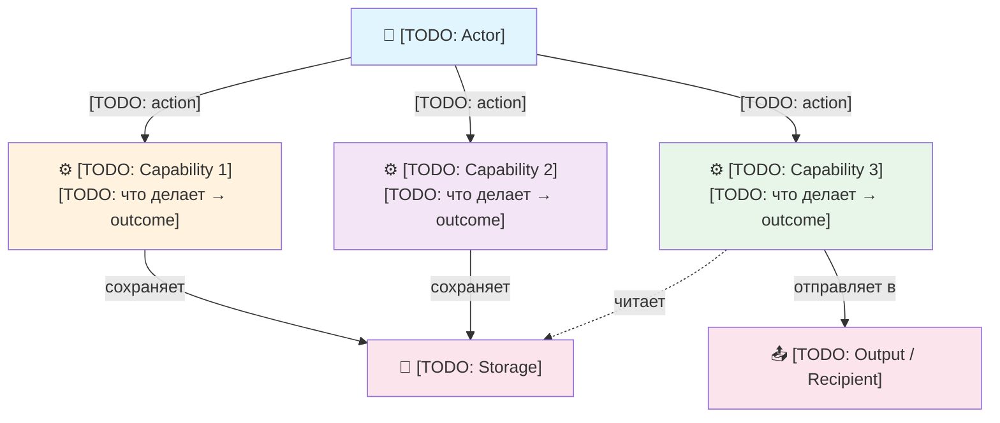
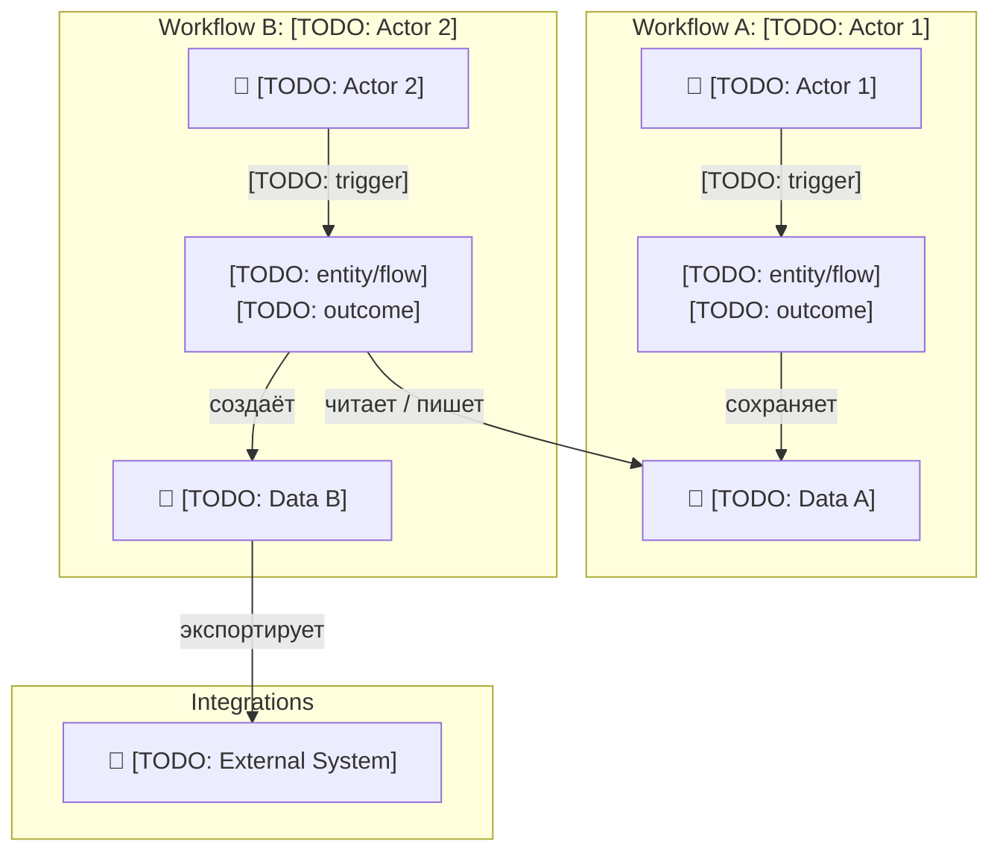
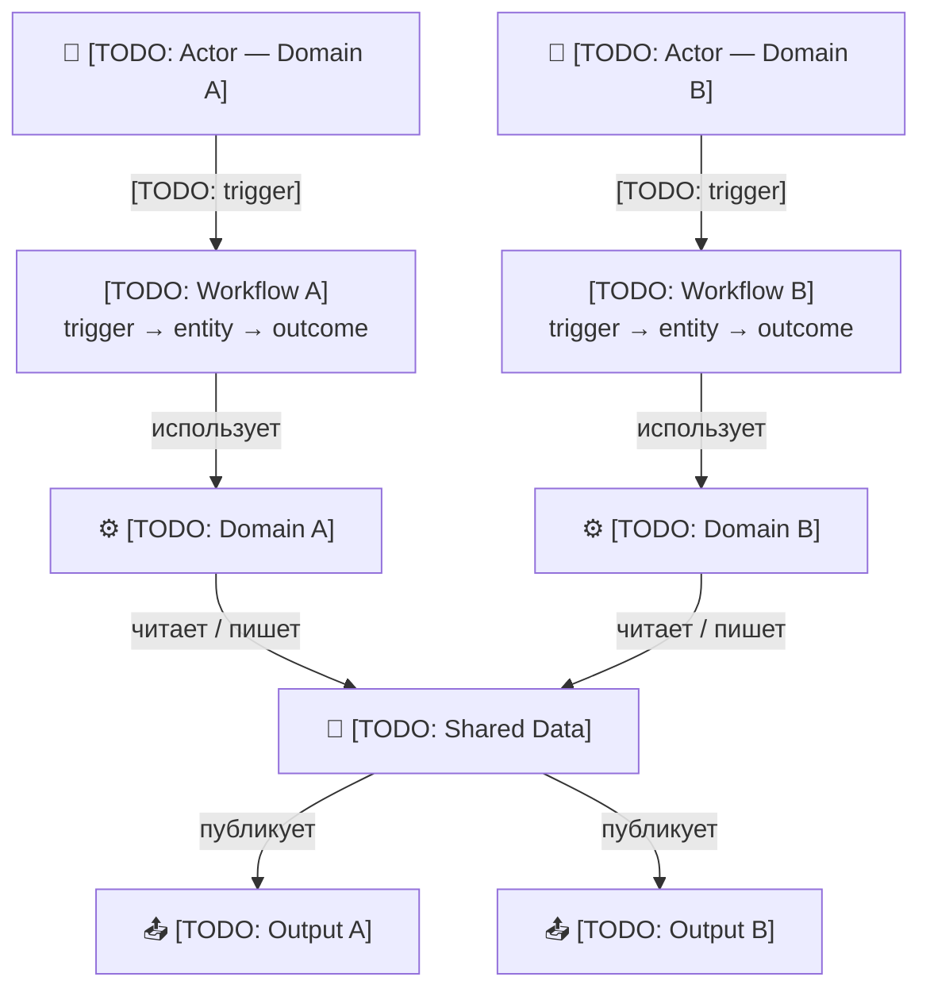
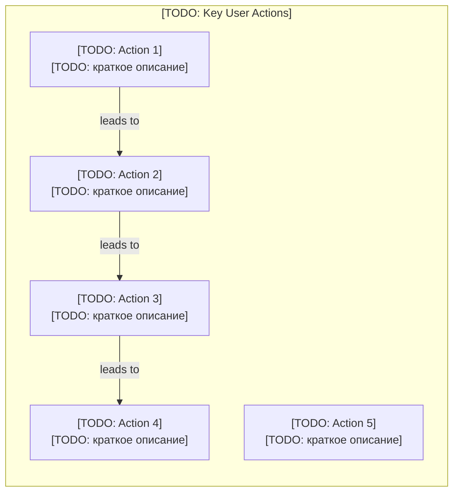

# USER-MAP — {{Project Name}}

Карта **поведения пользователей продукта**: что они делают, зачем, с какими сущностями, и какой результат получают.
Дополняет [SYSTEM-MAP](../docs/architecture/SYSTEM-MAP.md) (внутренняя архитектура) и [ARTIFACT-MAP](ARTIFACT-MAP.md) (жизненный цикл документов) внешним взглядом.

> ⚠️ Этот файл создаётся один раз при bootstrap с подстановкой `{{Project Name}}`. Не синхронизируется `sync-methodology.sh`. Проект владеет и поддерживает его самостоятельно.

---

## 1. Mission Statement

**Универсальная модель действий продукта:**

```
actor → trigger → entity/flow → outcome
```

**Что означает каждый элемент:**

| Element | Вопрос | Примеры |
|---|---|---|
| **actor** | Кто действует? | user, manager, AI agent, system, developer |
| **trigger** | Что запускает? | command, event, schedule, condition, manual run |
| **entity/flow** | С чем работает? | order, task, document, data, workflow, command |
| **outcome** | Что получается? | artifact created/updated, notification sent, state updated |

> Эта модель универсальна: ERP-manager создаёт order → manager проверяет → order confirmed. Developer запускает `/plan` → agent анализирует задачу → plan approved. Bot-user задаёт вопрос → система ищет ответ → recommendation выдана. Адаптируй под свой продукт — модель та же.

---

## 2. Product Capabilities

Функциональные возможности продукта с точки зрения пользователя. Выбери вариант по сложности.

### Как выбрать вариант

| Variant | Когда | Структура |
|---------|-------|-----------|
| **A (Simple)** | До 5 возможностей, один тип actor | Дерево actions |
| **B (Medium)** | Несколько типов actors с разными workflows | Workflows по actors + матрица |
| **C (Complex)** | 10+ возможностей, несколько domains | Три уровня: actors → flows → outcomes |

Если не уверен — **начни с Variant A**. Эволюция: A → B → C по мере роста продукта.

---

### Требования к диаграммам

**Mermaid обязателен.** USER-MAP (как и SYSTEM-MAP) всегда содержит Mermaid-диаграмму. Замена на ASCII/текст запрещена.

**Все стрелки подписаны.** Каждая связь объясняет что происходит (`-->|"действие"|`).

**Гибридный язык (EN + RU):**
- EN: технические термины, имена команд, имена файлов, node-labels — `actor`, `trigger`, `outcome`, `/plan`, `triggers.json`
- RU: описания поведения, аннотации, пояснения — "анализирует задачу", "создаёт артефакт"
- ❌ Транслитерация кириллицы латиницей (`"Stanet"`, `"Zapuskaet"`, `"dobavlen"`) — нарушение: это НЕ является RU. Только настоящая кириллица.
- Пример корректного node: `Plan["🗺️ Plan<br/>анализ · риски · решение"]`

**Типы стрелок:** `-->` активное действие; `-.->` чтение / пассивная связь.

---

### Variant A — Simple

<!-- diagram-sources: axes -->
_(ссылка: запусти `bash scripts/update-mermaid-links.sh`)_



**Замени `[TODO: ...]` на реальный контент:**

| Placeholder | Примеры — ERP | Примеры — Bot | Примеры — methodology |
|---|---|---|---|
| Actor | Manager | Telegram User | Developer |
| Action | "создаёт заказ" | "задаёт вопрос" | "запускает /plan" |
| Capability 1 | Order Management | Answer Search | Task Analysis |
| Storage | Orders DB | Knowledge Base | triggers.json, DEVLOG |
| Output | Email to customer | Telegram reply | Plan → /code |

---

### Variant B — Medium (несколько actors)

<!-- diagram-sources: axes -->
_(ссылка: запусти `bash scripts/update-mermaid-links.sh`)_



**Матрица actors × capabilities:**

| Capability | [TODO: Actor 1] | [TODO: Actor 2] | System / auto |
|---|---|---|---|
| [TODO: Capability A] | ✓ | ✗ | ✗ |
| [TODO: Capability B] | ✓ | ✓ (own) | ✓ (scheduled) |

---

### Variant C — Complex (multi-domain)

<!-- diagram-sources: axes -->
_(ссылка: запусти `bash scripts/update-mermaid-links.sh`)_



---

## 3. Recommended Scenarios

Типовые сценарии успешного использования (happy paths). Адаптируй под реальный контент проекта.

**Формат:** `Actor → trigger → что делает система → outcome`

```
Scenario 1 — [TODO: название]:
  [TODO: Actor] → [TODO: trigger] → система [TODO: действие] → [TODO: outcome]

Scenario 2 — [TODO: название]:
  [TODO: Actor] → [TODO: trigger] → система [TODO: действие] → [TODO: outcome]

Scenario 3 — [TODO: название]:
  [TODO: Actor] → [TODO: trigger] → система [TODO: действие] → [TODO: outcome]
```

> **Примеры (ERP):**
> - Manager создаёт Order → система проверяет наличие → Order confirmed, customer уведомлён
> - Accountant открывает период → система проверяет незакрытые позиции → отчёт доступен для подписи
>
> **Примеры (Bot):**
> - User задаёт вопрос → bot ищет в Knowledge Base → ответ с источником выдан
> - User уточняет → bot учитывает context → уточнённый ответ выдан
>
> **Примеры (methodology):**
> - Developer запускает `/plan` → agent анализирует задачу и риски → plan approved, начат `/code`
> - Developer запускает `/retro` → agent анализирует DEVLOG → тактические рекомендации выданы

---

## 4. Command Quick Reference

> _(Переименуй секцию если продукт не использует slash-команды: "Quick Actions", "Key Operations" и т.п.)_

<!-- diagram-sources: axes -->
_(ссылка: запусти `bash scripts/update-mermaid-links.sh`)_



**Матрица: action → что получает user → когда использовать:**

| Action | Outcome | Когда |
|---|---|---|
| [TODO: Action 1] | [TODO: outcome] | [TODO: условие] |
| [TODO: Action 2] | [TODO: outcome] | [TODO: условие] |
| [TODO: Action 3] | [TODO: outcome] | [TODO: условие] |

---

## 5. Action Flow Chains

Что следует за чем. Цепочки действий для типовых задач.

**Формат:** `Action A → Action B → Action C`

```
[TODO: Chain 1 — название]:
  [TODO: initial action] → [TODO: next] → [TODO: completion]

[TODO: Chain 2 — название]:
  [TODO: initial action] → [TODO: next] → [TODO: completion]

[TODO: Chain 3 — diagnose/recovery]:
  [TODO: признак проблемы] → [TODO: диагностика] → [TODO: решение]
```

> **Примеры (ERP):**
> - Order creation: create → check stock → confirm → notify customer
> - Return: initiate return → warehouse accepted → credit note created
>
> **Примеры (methodology):**
> - Standard cycle: `/plan` → `/code` → `/review` → `/deploy`
> - Structural analysis: `/architecture-audit` → `/plan` per S-N → `/code` → `/review` → `/deploy`
> - Repeated problem: `/diagnose` → `/plan` (с root cause) → `/code` → `/deploy`
> - Accumulation hygiene: `/retro` → тактические рекомендации → корректировка курса

---

## 6. Entity / Artifact Emergence

Когда и как возникают ключевые сущности и артефакты — с точки зрения user moment.

**Формат:** `moment/action → что появляется → next step`

```
[TODO: Moment 1]:
  Когда: [TODO: что делает user]
  Появляется: [TODO: entity/artifact]
  Next step: [TODO: что с ним делают дальше]

[TODO: Moment 2]:
  Когда: [TODO: что делает user]
  Появляется: [TODO: entity/artifact]
  Next step: [TODO: что с ним делают дальше]
```

> **Примеры (ERP):**
> - Moment: manager нажимает "Create Order" → появляется Order (status: Draft) → next: добавить line items
> - Moment: warehouse отмечает shipment → появляется Delivery Note + Order status updated → next: выставить Invoice
>
> **Примеры (Bot):**
> - Moment: первое сообщение user в сессии → появляется Dialog Context → next: классификация запроса
>
> **Примеры (methodology):**
> - Moment: developer запускает `/plan` → появляется Plan (approved) → next: `/code` по плану
> - Moment: обнаружена повторяющаяся проблема → появляется AGENT-GAPS entry → next: `/architecture-audit` для pattern analysis

---

## 7. Situational Guide

Когда что использовать. Матрица ситуаций для типовых user-задач.

| Situation | Рекомендуемое действие | Почему |
|---|---|---|
| [TODO: situation 1] | [TODO: action] | [TODO: причина] |
| [TODO: situation 2] | [TODO: action] | [TODO: причина] |
| [TODO: situation 3] | [TODO: action] | [TODO: причина] |
| [TODO: situation 4] | [TODO: action] | [TODO: причина] |

> **Примеры (ERP):**
> | Не знаю остаток товара | Открыть карточку товара → вкладка "Stock" | Актуально в реальном времени |
> | Client просит скидку | Изменить цену в строке Order → система пересчитает | Discount логируется автоматически |
>
> **Примеры (methodology):**
> | Проблема повторяется 2-й раз | `/diagnose` → root cause → `/plan` | N-й fix одного symptom = красный флаг |
> | Хочу понять архитектуру | Прочитать SYSTEM-MAP + USER-MAP | Два взгляда: внутренний и внешний |

---

## 8. Branching Modes / Deploy

> _(Оставь только если твой продукт имеет понятие "режима работы" или "среды". Иначе удали секцию.)_

Как продукт работает в разных режимах/средах:

| Mode | Кто использует | Ключевые отличия |
|---|---|---|
| [TODO: Mode 1 / environment] | [TODO: actor] | [TODO: что меняется в поведении] |
| [TODO: Mode 2 / environment] | [TODO: actor] | [TODO: что меняется в поведении] |

---

## Node Vocabulary

Закрепи канонические имена ключевых сущностей и используй их везде — в USER-MAP, SYSTEM-MAP, PRODUCT.md, DEVLOG. Синонимы создают путаницу при поиске.

```
| Canonical name    | Не использовать        |
|-------------------|------------------------|
| [TODO: Entity 1]  | [TODO: synonyms]       |
| [TODO: Entity 2]  | [TODO: synonyms]       |
```

> Пример (ERP): `Order` — не "заказ", "сделка", "deal". `Product` — не "товар", "артикул", "item".

---

## Refresh Policy

**Обновлять USER-MAP когда:**
- Добавлена новая capability или тип actor
- Изменился workflow между actions
- Появился новый тип outcome
- Изменилась ключевая entity/сущность

**Не обновлять при:** рефакторинге, bagfixes, улучшении производительности.

**Активные triggers:**
- `/product-check` (шаг 7) — проверяет `last_user_map_sync.plans_since ≥ 10` и наличие `[TODO: ...]`
- `/onboard` — проверяет `[TODO: ...]` при каждом запуске
- `/plan` шаг -3 — инкрементирует `last_user_map_sync.plans_since`

---

## Bootstrap

При запуске `new-project-init.sh`:
1. Файл копируется в `docs/product/USER-MAP.md`, `{{Project Name}}` подставляется автоматически
2. Выбери variant (начни с A)
3. Заполни Mission Statement под свой продукт (actor → trigger → entity → outcome)
4. Опиши 3-5 Recommended Scenarios (happy paths)
5. Опиши 2-3 Action Flow Chains
6. Замени все `[TODO: ...]` на реальный контент
7. Удали `[TODO: ...]` метки после заполнения

---

## Workspace Setup (Initial Setup)

Стандартная workspace-структура для консьюмера методологии:

```
[project-name]/                              ← папка-контейнер (не git, не workspace)
└── [project-name]-documentation/            ← git repo + Claude Code workspace (открываешь это)
    ├── .gitignore                            ← it-dev-methodology/, *-backend/, *-frontend/
    ├── .claude/commands/                     ← slash-commands (gitignored, восстанавливаются sync)
    ├── CLAUDE.md, DEVLOG.md, PRODUCT.md...  ← methodology artifacts (git-tracked)
    ├── docs/                                 ← architecture, ADRs, product maps
    ├── it-dev-methodology/                   ← gitignored (клонирован сюда для sync)
    ├── [project-name]-backend/               ← gitignored (клонирован сюда, виден Claude)
    └── [project-name]-frontend/              ← gitignored (клонирован сюда, виден Claude)
```

**Что открывать в Claude Code:** `[project-name]-documentation/` — единственный workspace.
**Code repos** клонированы внутри, gitignored — Claude их видит, git их не трекает.

### Новый проект (первый раз)

```bash
mkdir [project-name] && cd [project-name]
git clone <methodology-repo-url> it-dev-methodology
git clone <documentation-repo-url> [project-name]-documentation
bash it-dev-methodology/scripts/new-project-init.sh [project-name] [project-name]-documentation/
cd [project-name]-documentation
git clone <methodology-repo-url> it-dev-methodology
git clone <backend-url> [project-name]-backend
```

Открой `[project-name]-documentation/` в Claude Code. Запусти `/onboard` → `/plan`.

### Присоединиться к существующему проекту

```bash
mkdir [project-name] && cd [project-name]
git clone <documentation-repo-url> [project-name]-documentation
cd [project-name]-documentation
git clone <methodology-repo-url> it-dev-methodology
bash it-dev-methodology/scripts/sync-methodology.sh .
git clone <backend-url> [project-name]-backend
```

Открой `[project-name]-documentation/` в Claude Code.

> `/onboard` проверяет наличие `[TODO: ...]` в USER-MAP и предупреждает если они остались.
> `/product-check` проверяет свежесть USER-MAP через `triggers.json → last_user_map_sync`.

---

## Notes

- USER-MAP = **что делает user продукта** (actor → trigger → entity/flow → outcome); SYSTEM-MAP = как оно устроено внутри; ARTIFACT-MAP = жизненный цикл документов
  - ✅ "Create Order", "Submit Report", "Run /plan", "Ask bot question"
  - ❌ "REST endpoint", "Async queue", "database connection" — внутренняя реализация
- Диаграммы максимум **2-3 уровня глубины** — детали идут в PRODUCT.md
- **Если users продукта — сами developers** (например, methodology-platform): USER-MAP показывает dev workflow, slash-commands и repo-структуру — это и есть их product capabilities. Модель та же: developer (actor) → запускает `/plan` (trigger) → task с рисками (entity) → approved plan (outcome).
