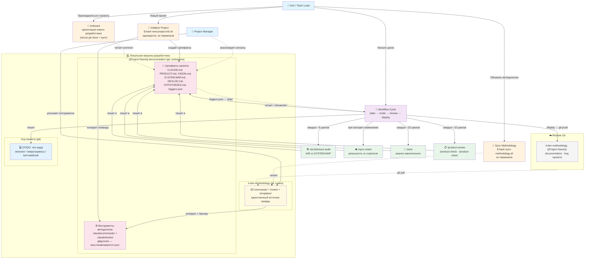
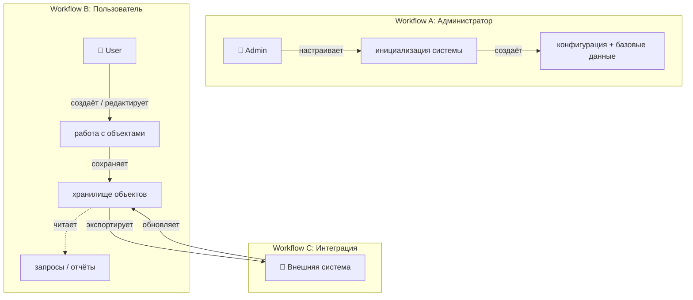
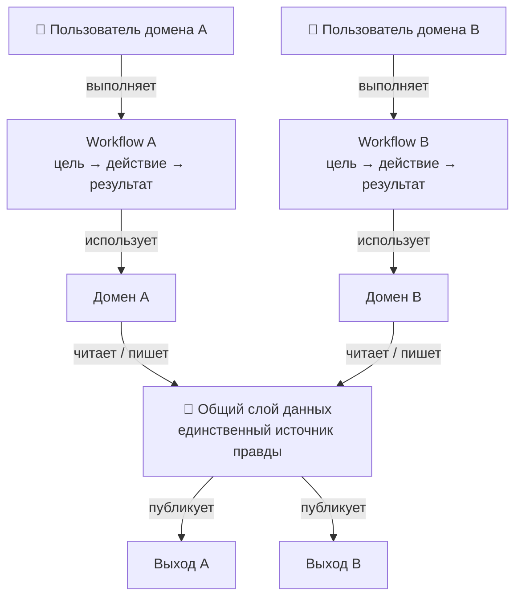

# USER-MAP — {{Project Name}}

This artifact has **two parts**:
- **Part 1: Dev Setup** — how developers and PM work with the three-repo structure. Near-complete skeleton, minimal customization.
- **Part 2: Product Capabilities** — what end users of {{Project Name}} can do. Fully customizable per project type.

> ⚠️ This file is created ONCE during bootstrap with `{{Project Name}}` substitution. It is NOT synced by `sync-methodology.sh`. Your project owns and maintains this diagram.

---

## Требования к диаграммам

**Mermaid обязателен.** USER-MAP (как и SYSTEM-MAP) всегда содержит Mermaid-диаграмму. Замена на ASCII/текст запрещена.

**Все стрелки подписаны.** Стрелка без метки — это неоднозначность. Каждая связь должна объяснять что происходит.

**Гибридный язык (EN + RU):**
- EN: команды (`git pull`, `/deploy → git push`, `triggers.json → /plan`), имена файлов, технические термины
- RU: описания действий (`копирует + баннер`, `создаёт артефакты`, `анализирует сигналы`)

**Типы стрелок:** `-->` сплошная — активное действие; `-.->` пунктирная — чтение / пассивная связь.

**Repo / setup контекст обязателен.** Новый разработчик должен понять из диаграммы откуда берутся команды и куда деплоится код.

---

## Part 1: Dev / Methodology Setup

Общая структура для всех проектов на этой методологии. Кастомизируй только узел отмеченный `[TODO]`.

### Легенда

| Элемент | Тип узла |
|---|---|
| 👤 | Актор (человек) |
| 📦 | Источник правды (канон) |
| ⚙️ | Инструменты методологии (gitignored) |
| 💾 | Хранилище артефактов проекта |
| 💻 | Код проекта (сервисы, монолит, bot) |
| 🚀🧭🔄 | Точки входа / действия разработчика |
| 🏗️👁️🔁📋 | Периодические команды методологии |

### Node Vocabulary

Используй точно эти имена — так же в SYSTEM-MAP, PRODUCT.md, DEVLOG. Синонимы создают путаницу при поиске.

| Каноническое имя | Не использовать |
|---|---|
| Артефакты проекта | project files, документы, docs, artifacts |
| Инструменты методологии | команды, scripts, tools, commands |
| Workflow Cycle | dev cycle, рабочий процесс, pipeline |
| единственный источник правды | source of truth, канон (только в комментариях) |
| `{{Project Name}}-documentation` | project repo, docs repo, project-docs |
| Код проекта | source code, codebase, services (в общем контексте) |

### Что кастомизировать в Part 1

- **`[TODO: тип кода]`** — замени на реальное описание: `монолит + React frontend`, `Telegram bot + webhook server`, `N микросервисов (auth, api, worker)`. После замены удали `[TODO: ...]`.
- Если docs и code в **одном репо** — объедини subgraph-и `DocRepo` и `CodeRepos` в один.

---

## Part 2: Product Capabilities

Что могут делать **конечные пользователи продукта** (не разработчики). Выбери вариант по сложности.

| Вариант | Когда | Структура |
|---------|-------|-----------|
| **A (Simple)** | До 5 возможностей, одна роль | Дерево возможностей |
| **B (Medium)** | Несколько ролей с разными workflow | Workflow по ролям + матрица |
| **C (Complex)** | 10+ возможностей, несколько доменов | Три уровня: workflow + домены + данные |

Если не уверен — **начни с Variant A**. Эволюция: A → B → C по мере роста.

---

### Variant A — Simple

**Замени `[TODO: ...]` узлы:**
- `Возможность 1, 2, 3` → реальные фичи продукта
- `Хранилище` → что хранится (БД, облако, файл)
- `Получатель` → куда уходит результат (API, чат, файл)

**Примеры:**

ERP: `Cap1: Управление каталогом` / `Cap2: Создание заказов` / `Cap3: Экспорт на платформу` / `Storage: БД товаров + история` / `Output: API платформы`

Telegram bot: `Cap1: Создание задач из сообщений` / `Cap2: Напоминания по расписанию` / `Cap3: Экспорт в календарь` / `Storage: Список задач` / `Output: Calendar API + Telegram`

---

### Variant B — Medium (Несколько ролей)

Для проектов где разные пользователи взаимодействуют по-разному.

**Матрица ролей:**

| Возможность | Admin | User | Внешняя система |
|---|---|---|---|
| Создать / редактировать | ✓ | ✓ (свои) | ✓ (API) |
| Удалить | ✓ | ✗ | ✗ |
| Просмотр аналитики | ✓ | ✗ | ✓ (read-only) |
| Экспорт данных | ✓ | ✓ (свои) | ✓ |

---

### Variant C — Complex (Multi-domain)

---

## Refresh Policy

**Обновлять USER-MAP когда:**
- Добавлена новая крупная возможность продукта
- Изменился workflow между возможностями
- Новый тип пользователя с отдельным workflow
- Изменился получатель результата (новый API, платформа)
- Изменилась структура репозиториев (новый сервис, объединение репо)

**Не обновлять при:**
- Внутреннем рефакторинге (пользователь не видит)
- Багфиксах
- Улучшении производительности

**Sync trigger:** `.claude/state/triggers.json` — поле `last_user_map_sync`.

---

## Bootstrap (для новых проектов)

При запуске `new-project-init.sh`:
1. Этот файл копируется в `docs/product/USER-MAP.md`
2. `{{Project Name}}` автоматически подставляется
3. Заполни `[TODO: тип кода]` в Part 1 под реальный стек
4. Выбери вариант Part 2 (начни с A)
5. Удали инструкционные комментарии после заполнения
6. PRODUCT.md — детальное поведение; USER-MAP — верхний уровень

---

## Notes

- Part 1 (Dev Setup) показывает **пользовательские возможности разработчика** — /plan, /code и т.п. здесь допустимы как user capabilities
- Part 2 (Product Capabilities) показывает **возможности конечных пользователей продукта**
  - ✅ "Создать статью", "Экспорт в API", "Синхронизация с облаком"
  - ❌ "REST endpoint", "Async queue", "database connection" — внутренняя реализация
- Диаграммы максимум **2-3 уровня глубины** — детали идут в PRODUCT.md
- USER-MAP = "что умеет пользователь"; SYSTEM-MAP = "как оно устроено внутри"
