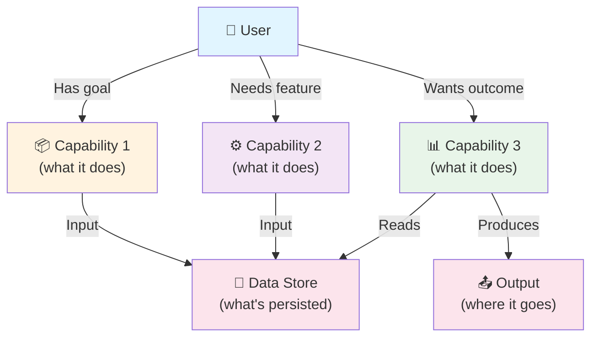
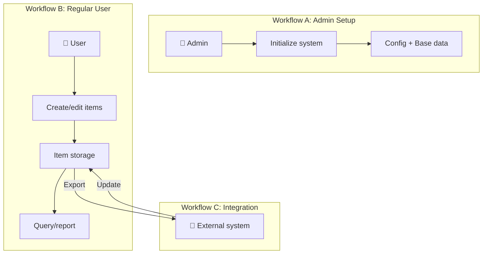
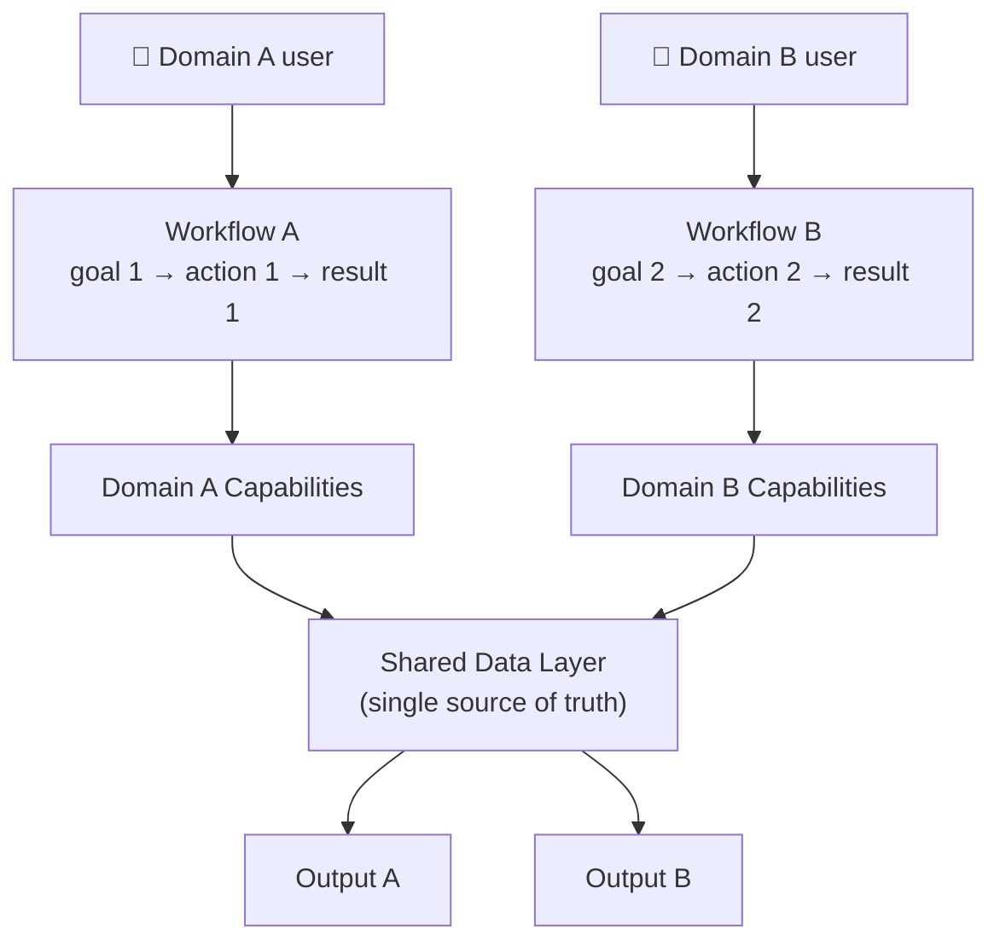

# USER-MAP — Product Capabilities & User Workflows

**Project:** {{Project Name}}

This artifact maps **what users can do** with this product — the functional capabilities from user perspective. 
It complements [SYSTEM-MAP](../docs/architecture/SYSTEM-MAP.md) (internal structure) with external capability view.

**Note:** USER-MAP describes **this product's features/workflows**, not methodology commands.

> ⚠️ **Important:** This file is created ONCE during bootstrap with `{{Project Name}}` substitution. It is NOT synced by `sync-methodology.sh` (unlike commands/hooks). Your project owns and maintains this diagram.

---

## How to use this template

**Pick a variant based on your project size:**

| Variant | Use when | Structure |
|---------|----------|-----------|
| **A (Simple)** | Solo dev, single-domain, < 5 main capabilities | Single capability tree |
| **B (Medium)** | Team, multi-domain, user roles vary | Workflow + user archetypes |
| **C (Complex)** | Multi-service platform, 10+ capabilities across domains | Three-tier (workflow + tactical + data) |

If unsure — **start with Variant A**. Evolution: A → B → C as scope grows.

---

## Variant A — Simple (Recommended for new projects)

**Core insight:** User can do X, Y, Z. Here's the workflow connecting them.



### Template instructions for Variant A:

1. **Replace placeholder nodes:**
   - `Capability 1, 2, 3` → your product's main features (e.g., "Create articles", "Generate PDFs", "Export to platform")
   - `Data Store` → what gets persisted (e.g., "Database", "Cloud storage")
   - `Output` → where results go (e.g., "API", "File system", "External service")

2. **Example — ERP:**
   ```
   Cap1: Manage product catalog (CRUD articles)
   Cap2: Create orders from catalog
   Cap3: Generate export for sales platform
   Storage: Product DB + Order history
   Output: Sales platform API
   ```

3. **Example — Telegram bot:**
   ```
   Cap1: Create tasks from messages
   Cap2: Send reminders at scheduled time
   Cap3: Export tasks to calendar
   Storage: Task list in memory/DB
   Output: Calendar API + Telegram chat
   ```

4. **Example — Methodology-platform:**
   ```
   Cap1: Initialize project with artifacts (CLAUDE.md, PRODUCT.md, etc.)
   Cap2: Sync methodology updates to consumer projects
   Cap3: Validate artifact consistency (triggers, versions)
   Storage: .claude/ directory + triggers.json
   Output: Synced consumer projects
   ```

---

## Variant B — Medium (Team with different roles/workflows)

**For projects where different users interact differently with features.**

Create separate diagrams for each user type or workflow path:



**Then create a capability matrix:**

| Capability | Admin | User | External system |
|---|---|---|---|
| Create/edit items | ✓ (system) | ✓ (own items) | ✓ (API) |
| Delete items | ✓ | ✗ | ✗ |
| View analytics | ✓ | ✗ | ✓ (read-only) |
| Export data | ✓ | ✓ (own data) | ✓ |

---

## Variant C — Complex (Multi-service / Multi-domain)

**For platforms with distinct capability domains that operate semi-independently.**

Create **three-tier view:**

1. **User workflows** (top level — what users want to accomplish)
2. **Capability domains** (middle — grouped features by domain)
3. **Data layer** (bottom — shared state / persistence)



---

## Refresh policy

**When to update USER-MAP:**
- New major capability added to product
- Workflow between capabilities changed
- New user type/role with different workflow
- Product output destination changed (e.g., now exports to platform X)

**When NOT to update:**
- Internal refactoring (user doesn't see it)
- Bug fixes
- Performance improvements

**Sync trigger:** See `.claude/state/triggers.json` — `last_user_map_sync` field tracks freshness.

---

## For new projects (bootstrap)

When using `new-project-init.sh`:
1. This file is copied to `docs/product/USER-MAP.md`
2. Replace `{{Project Name}}`
3. Start with **Variant A** (simplest)
4. Fill in your actual capabilities, not methodology-specific ones
5. Reference PRODUCT.md for detailed behavior — USER-MAP stays high-level
6. Evolve to Variant B/C only when you have multiple workflows or user types

---

## Notes

- USER-MAP shows **user-facing capabilities**, not internal architecture
  - ✅ "Create articles", "Export to API", "Sync to cloud"
  - ❌ "REST endpoint", "/code command", "Async queue"
- Keep diagrams **2-3 levels deep max** — add more detail to PRODUCT.md
- Link to SYSTEM-MAP but remember: SYSTEM-MAP = "how we built it", USER-MAP = "what user can do"
